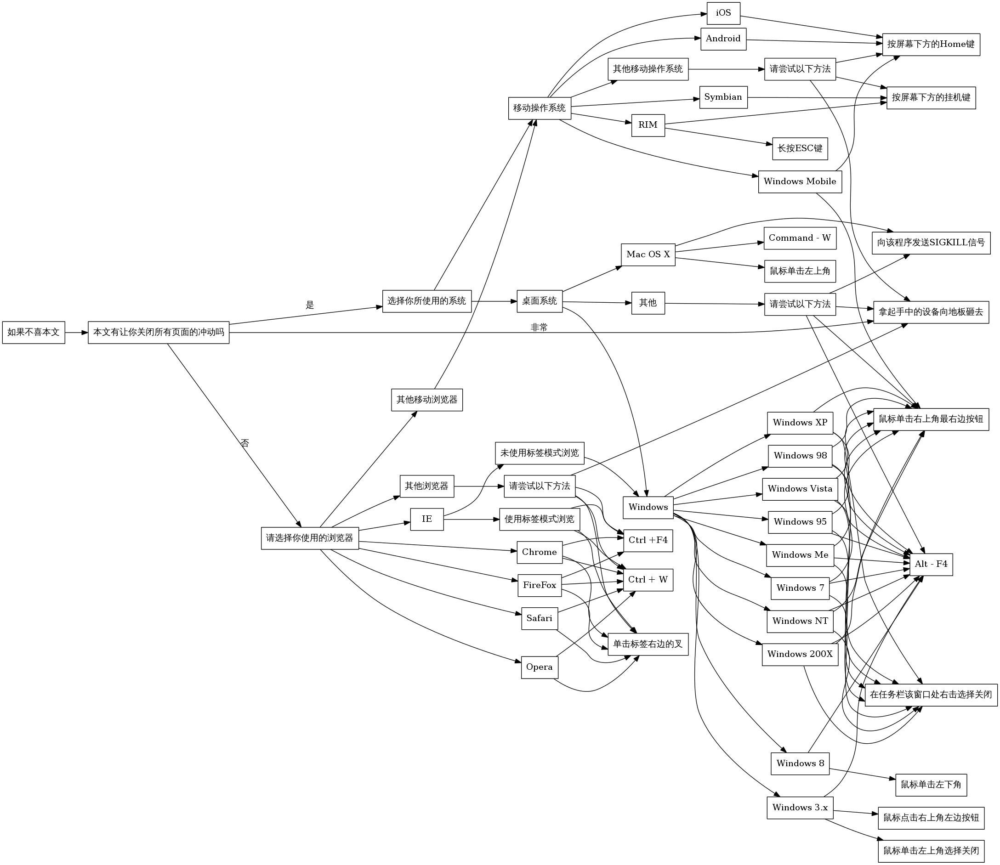

>没想到Blog上的第一篇文章竟然是如此无聊的内容。

很多文章的开头都有类似“不喜请按ctrl+W （或者点下窗口右上角..alt+F4也行..）”的句子，不过显然这并没有覆盖所有情况……于是为了顺便学习传说中的DOT，巨蛋疼地画出了《如果不喜本文》攻略全图，如下：（有错误或需要增加烦请提出）

[点我](/images/how_to_close_this_page.jpeg)高清大图，DOT文件[在此](http://pastebin.com/xjun37py)

