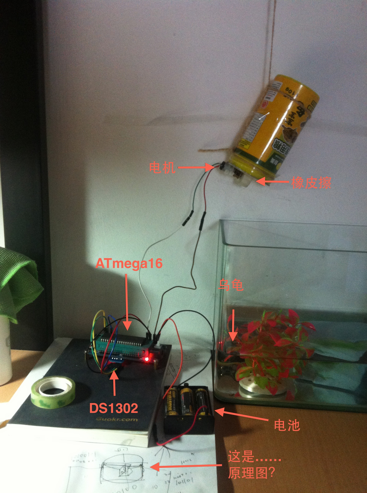
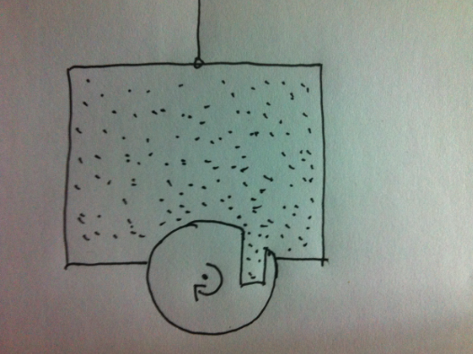

> 唔…总之就是一个定时掉落数粒直径2-3毫米球状物体的设备，使用单片机控制，从DS1302模块获得时间。

### 机械部分

机械部分最麻烦，特别是在寝室这样设备匮乏的地方，最终使用一块橡皮擦加一个小车上拆下来的电机搞定。

“原理图”如下：

旋转的部分是用一块橡皮擦抠出来的，为减小摩擦力需要在表面贴上透明胶布，然后与电机连接。
这个部分的debug比较蛋疼，要细心调整橡皮擦的形状、大小、开口的大小方向等等等等，
最终使得每周期能掉落1-3颗食物。

### 代码部分

使用的时间模块是DS1302，每天早晚十点喂食一次。代码见[Github](https://github.com/blahgeek/AVR-DS1302)。

### TODO

使用红外传感器精确控制转一周的时间。

