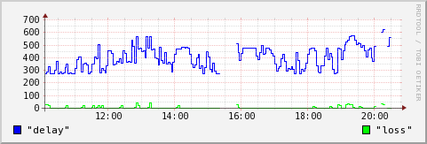
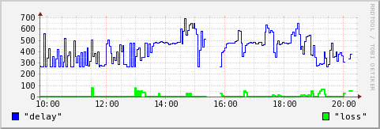
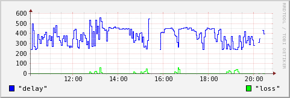
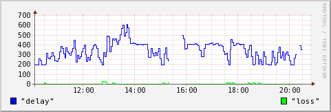

> 为购买Linode时选择服务器地点做参考。

- 测试时间：2013年11月13/14日
- 测试机器：北京教育网
- 测试方法：每次发送4个ping，统计丢包率和平均延时（期间有一段时间因故数据丢失）
- 绘图：RRDTool
- Loss值为丢包率，从0到100，Delay为延时（毫秒）

speedtest.tokyo.linode.com(106.187.96.148):

speedtest.london.linode.com(176.58.107.39):

speedtest.newark.linode.com(50.116.57.237):

speedtest.atlanta.linode.com(50.116.39.117):

speedtest.dallas.linode.com(50.116.25.154):

speedtest.fremont.linode.com(50.116.14.9):

