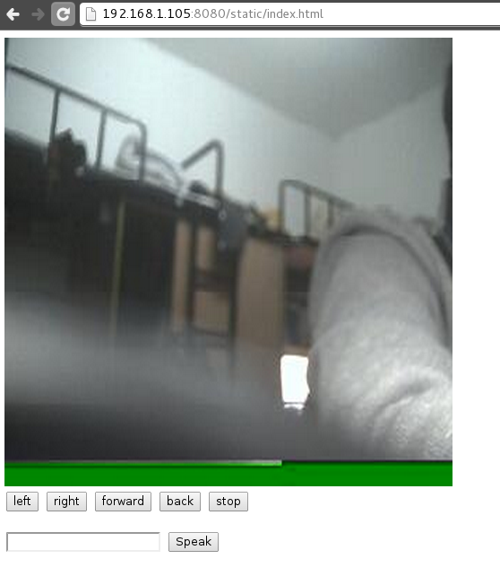

简单地说，功能有：

- 通过网页控制（于是可以在iPad，手机上控制）
- 可以控制小车前进、后退、转弯
- 能实时看到小车摄像头画面
- 能命令小车读出语音

先上图：




### 功能的实现

小车前进后退转弯：使用了电设时候被遗弃的L9110H芯片，控制端输入01、10、00或11时分别为正转、反转、停止。
使用了两个L9110H，用4个GPIO控制。下面几句命令即使一个轮子正转。

```bash
gpio mode 0 out
gpio mode 1 out
gpio write 0 1
gpio write 1 0

```
摄像头使用了USB摄像头，即插即用，在命令行下拍照：

```bash
streamer -c /dev/video0 -o out.jpeg

```
语音使用espeak。

### 远程控制页面

用web.py写的一个简单的控制页面。
向`/takephoto`发送一个get请求就会拍一张照片，类似地，向`/move`发送请求和数据就会相应地移动。
向`/speak`发送数据就会读出语音。

```python
import web

TAKE_PHOTO = 'streamer -c /dev/video0 -o static/out.jpeg'.split(' ')

urls = (
        '/takephoto', 'TakePhoto', 
        '/speak', 'Speak', 
        '/move', 'Move'
        )

def doMove(s):
    IO = '4310'
    for i in xrange(4):
        call(['gpio', 'write', IO[i], s[i]])

class TakePhoto:
    def GET(self):
        call(TAKE_PHOTO)

class Speak:
    def POST(self):
        i = web.input()
        call(['espeak', i.content])

class Move:
    def POST(self):
        i = web.input()
        if i.direction == 'forward':
            doMove('1001')
        elif i.direction == 'back':
            doMove('0110')
        elif i.direction == 'right':
            doMove('1010')
        elif i.direction == 'left':
            doMove('0101')
        else:
            doMove('0000')

if __name__ == '__main__':
    app = web.application(urls, globals())
    app.run()

```
页面端，就几个按钮分别代表前后左右和停止，以及一个发送语音句子的文本框。
关于图像，采用的方法是每隔两秒发送一个拍照请求并且重新载入图片。

```html
<body>
    
    <br />
    <button onclick="$.post('/move?direction=left')">left</button>
    <button onclick="$.post('/move?direction=right')">right</button>
    <button onclick="$.post('/move?direction=forward')">forward</button>
    <button onclick="$.post('/move?direction=back')">back</button>
    <button onclick="$.post('/move?direction=stop')">stop</button>
    <br /> <br />
    <input type="text" id="content">
    <button onclick="$.post('/speak', {content: $('#content')[0].value})">Speak</button>
    <script>
        setInterval(function(){
            $('#myimg').attr('src', '/static/out.jpeg?' + new Date().getTime());
            $.get('/takephoto');
        }, 2000);
    </script>
</body>

```
最后还是感叹一下，人生苦短，快用Python。

