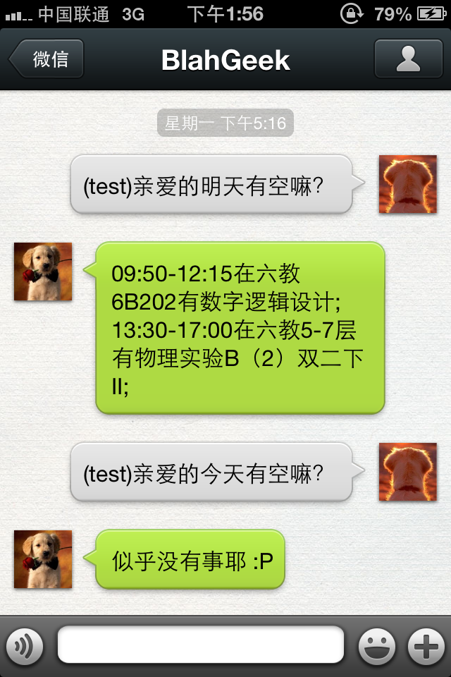

先上效果图：

[Fork Me On Github](https://github.com/blahgeek/weixin-mp)

代码比较乱，但可以使用。

申请微信公众平台后，微信服务器能将每个用户发至该帐号的消息
以HTTP请求的方式发送至你提供的服务器上，然后服务器能够根据
内容回复该请求，做到自动回复。

在[微信公众平台](https://mp.weixin.qq.com/)申请公众平台帐号，
申请时需要提供身份证号码照片等真实信息，申请后大约过一天
就能通过。文档[在此](http://mp.weixin.qq.com/wiki/index.php?title=%E6%B6%88%E6%81%AF%E6%8E%A5%E5%8F%A3%E6%8C%87%E5%8D%97)。

**WARNING**：这个东西给基友玩玩就可以了，女友用的话...以下为脑补场景：

