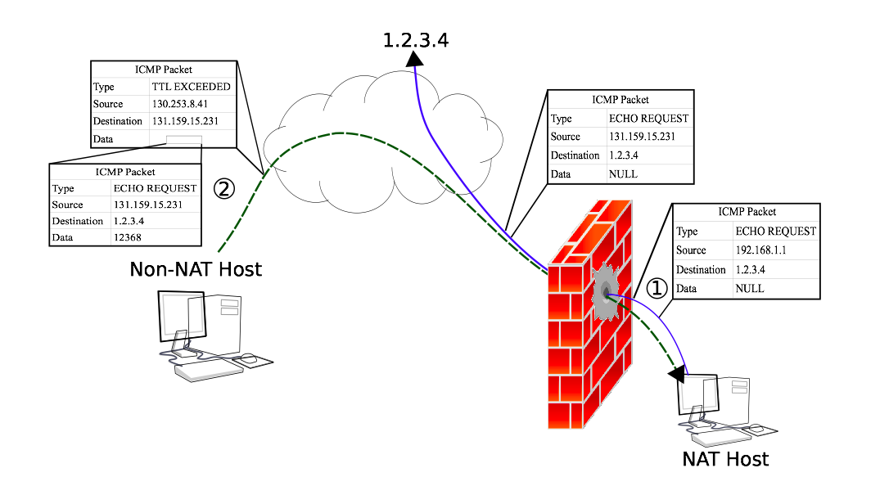

> 是的，它可以使两台**均在NAT/防火墙后**的机器、**不需要**任何第三方服务器、**不需要**端口转发，进行通信。原理基于[这篇Paper](/files/pwnat.pdf)，[pwnat](http://samy.pl/pwnat/)就是基于这个方法的一个实现，我用Python实现了一个简易的版本[pypwnat](https://github.com/blahgeek/pypwnat)。

### 适用环境

- 两台机器（我们分别叫做客户端和服务器端）可以均在NAT/防火墙后（当然也可以不是）
- 不需要其他任何第三方、不需要端口转发

仅有的要求：

- 客户端需要知道服务器端的外网IP（废话）

### 这不科学！怎么工作的？




- 随便挑一个死的IP地址（在这里我们用`59.66.1.1`，ping之无回应即可）
- 服务器端每隔一段时间对`59.66.1.1`发送一个ICMP echo request（ping），当然，什么都不会发生，因为不会有回应
- （开始有趣了）客户端向服务器端发送ICMP time exceed包，把自己假装成是服务器端与`59.66.1.1`之间的一个节点，告诉服务器端你发送的ping超时了（就想traceroute的原理），当然，这个包会被服务器端的NAT/防火墙通过并转发给它
- 现在，服务器端知道客户端的外网地址了（而且客户端本来就知道服务器端的外网地址）
- 服务器端使用某个端口（随便选一个吧，12345）向客户端的某个端口（比如23456）发送UDP包，当然，这个包会被客户端的NAT/防火墙拒绝
- 客户端也同时使用端口23456向服务器端12345端口发送UDP包，而这个包会被服务器端的NAT/防火墙通过并转发！因为它会认为这是之前服务器发出的包的回应
- 好了，服务器现在再发一个UDP包的话，同理也会被客户端的NAT/防火墙通过并转发
- Bingo!

### [pypwnat](https://github.com/blahgeek/pypwnat)运行示例

服务器端：

```
hatsune ~ > sudo python2 pypwnat.py -s
[MainThread] DEBUG : Sending echo request with id=42, seq=42.
[MainThread] DEBUG : Got ICMP response!
[Thread-1] DEBUG : Handling response in new thread.
[MainThread] DEBUG : Sending echo request with id=42, seq=42.
[Thread-1] INFO : Got response from 101.5.109.89

```
客户端：

```
Blah-MacbookAir ~/D/p/pypwnat (master)> sudo python pypwnat.py -c 106.186.24.147
[MainThread] DEBUG : Sending hello message via UDP.
[MainThread] DEBUG : Sending time exceed message.
[MainThread] INFO : Got UDP response!
Hello from pypwnat

```
