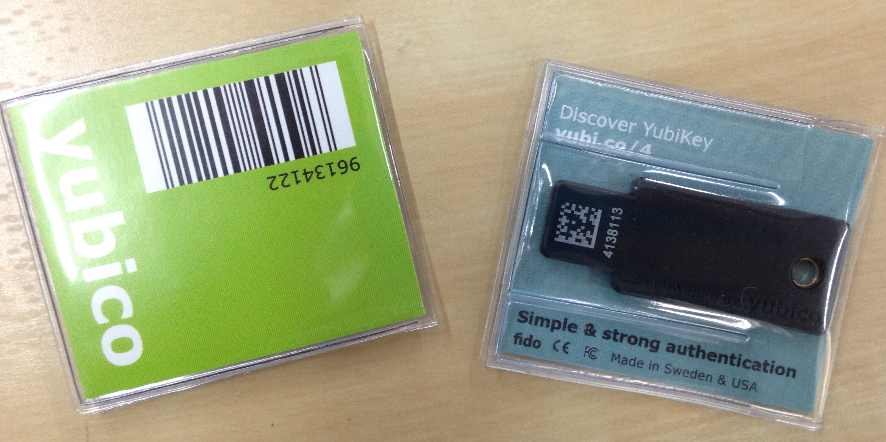
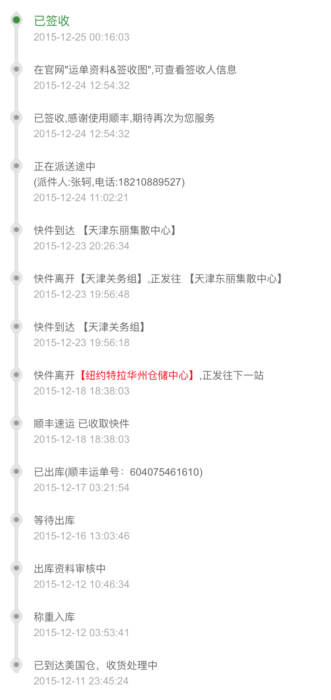

很难跟人描述[YubiKey](https://www.yubico.com)是个什么东西，[维基百科](https://en.wikipedia.org/wiki/YubiKey)的描述是“一个支持OTP、公钥加密签名、U2F协议的硬件认证设备”。它是一个长得像U盘的设备，主要功能为能够插入USB口后作为一个键盘设备，触摸按钮后输入一次性密码（OTP）来进行身份验证，另外它还能用作OpenPGP Smart Card设备等。

作为一件加(zhuang)密(bi)神器，了解这个东西后果断剁手购买…走的海淘丰运转运（据说它作为美国政府管制的高强度加密设备，直邮至中国会需要提供公司证明等）历经15天终于到手，购买的是十月份新出的[YubiKey 4](https://www.yubico.com/2015/11/4th-gen-yubikey-4/)型号，[Github优惠](https://www.yubico.com/github-special-offer/)加运费花费每个约¥250（一共买了俩）。

## 功能

可能由于功能和型号太多，官网上的文档虽然很全很详细却缺乏系统性，在到手之前我一直没搞懂几个功能之间的关系。以我手中的YubiKey 4为例，它主要有以下几类功能：（不同型号的功能比较可以看[这张表](https://www.yubico.com/products/yubikey-hardware/)）：

### 作为键盘设备（HID）

这是它主要介绍的功能，能够模拟键盘设备向电脑输入一串生成的密码，兼容性最好。其中还包含多种模式：OTP、Static、Challenge-Response、HTOP，

- OTP: `KEY_ID+AES(AES_KEY, SECRET, COUNT++)`即生成的密码包含明文的KEY_ID和对称加密的SECRET和计数器。第一次使用前需要把KEY_ID，AES_KEY，SECRET提交至验证服务器（Yubico提供或者自己搭建），之后应用程序每次通过服务器验证密码的可靠性（解码后SECRET对应、COUNT增大（防止重放攻击））。
- Static: 静态密码。顾名思义，每次生成固定的一串密码（并没有什么用）。
- Challenge-Response: `HMAC(SECRET, INPUT)`即可以通过HID接口给定一个输入，输入HMAC的计算结果。输入需要本地代码实现。
- HOTP: `HMAC(SECRET, COUNTER++)`算法与Challenge-Response类似，然而使用累加计数器代替了输入，并且HTOP是一个[标准协议](https://twofactorauth.org/)，许多网站和设备都兼容该标准。

在YubiKey中包含两个configuration slot，每一个slot可以单独配置以上模式中的其中一种，通过短触和长触来选择输入。

我个人认为，虽然这几种模式应用于网站两步验证等场景下非常方便，兼容性好，然而由于使用对称加密算法，其理论上还是非常不科学的，只要服务器端（验证服务器）的密文被泄漏，所有的信息都可以进行伪造。

### U2F

[U2F](https://developers.yubico.com/U2F/)是一个开源的认证标准协议，使用非对称加密算法，在每次需要认证是设备可以对challenge信息使用私钥进行签名来完成认证。作为一个开源的标准协议，Google、Dropbox等网站都支持这种协议的两步验证，然而现阶段浏览器端仅有Chrome支持。

### OpenPGP Smart Card

YubiKey还可以作为标准的OpenPGP Smart Card使用，用来存储PGP私钥（设备中私钥是可写不可读的，解密／签名操作在设备上完成）。关于PGP Smart Card的更多信息，可以参考[这篇文章](https://jclement.ca/articles/2015/gpg-smartcard/)。

以上提到的三个功能是可以同时使用的，相互之间并不冲突。

## 应用

鉴于YubiKey实现的功能的多样性，它能应用／折腾的场景还是非常丰富的，举例来说：

- 用作网站的两步验证，比如Google，Dropbox，[Fastmail](https://blog.blahgeek.com/fastmail-is-good/)等
- 用于操作系统的登陆，官方提供了[PAM模块](https://developers.yubico.com/yubico-pam/)支持Linux和OS X
- 使用OpenPGP签名、解密文件
- ……

就我个人来说，暂时的主要用途为PGP和某些网站的两步验证，更多用法有待发现…（世界上最悲伤的事情就是买了加密/认证设备后，发现自己根本没有什么信息值得加密/认证的……）

欢迎使用我的[PGP Key](https://keybase.io/blahgeek/key.asc)给我发加密信息…
