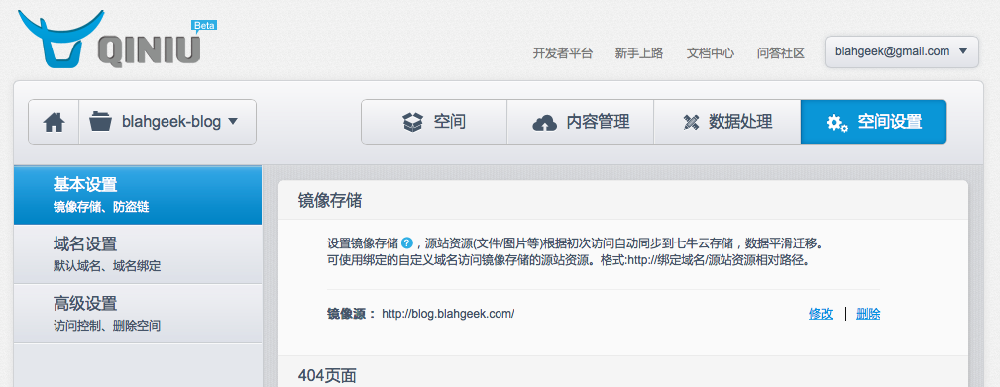
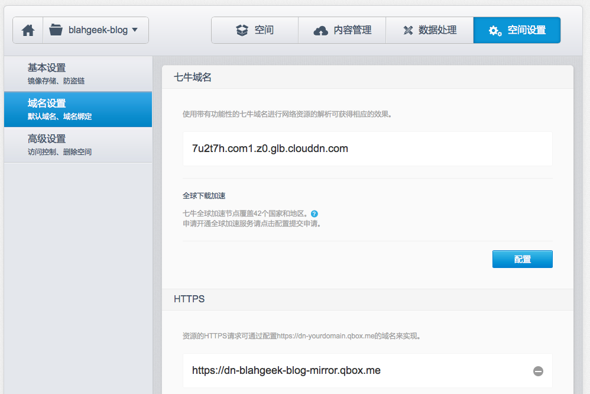

[七牛云存储](www.qiniu.com)是一个优秀的国内云存储服务。它为免费为用户提供10G的存储空间和每月10G的流量，超出后的价格也比较合理，并且国内访问速度完爆Amazon S3等国外存储服务。当然作为一个国内的服务商，身份认证等肯定是必须的，自定义域名等功能还需要备案，比较麻烦，不过基本使用还是很不错的。

虽然无法使用自定义域名来为整个网站进行加速（需要备案），但是可以将静态文件（图片等）通过七牛CDN的域名访问，可以大大增加网站的访问速度，并且对于个人博客来说免费额度足够用了。更好的是，七牛CDN的域名支持https，也就是说如果你的网站主站是https的话，引用CDN域名的图片并不会出现[黄色三角形](http://stackoverflow.com/questions/6465137/partial-ssl-in-chrome)的情况。更更好的是，七牛CDN支持设置读源地址，即可以自动镜像某一个域名的资源，不需要手动上传文件。

## General Howto

首先在七牛新建一个“空间”，设置“镜像存储”地址为博客地址。然后在“域名设置”中复制CDN的域名，最后将网站所有的``替换为``即可～（根据需要选择http域名或https域名）再次打开网站，七牛会自动从源地址获取资源并分发至全国CDN！





## Resize Images

七牛还支持对图片、音频视频的处理。比如可以在url参数中指定图片长宽来获取缩小的图片，加快访问速度。比如：

```
<a href="/images/aaa.png">
    
</a>
```

会将图片缩小至宽度800像素，适合在页面中载入，并且点击图片可以查看原图。可以对上文的图片审查元素查看详情。

## Jeklly Plugin

把下面的代码扔进`_plugins/qiniu_cdn_filter.rb`，然后在`_config.yml`中加入以下两行：

```
cdn_domain: https://dn-blahgeek-blog-mirror.qbox.me
cdn_img_suffix: ?imageView2/2/w/800
```

最后将template中的`content`改为`content | cdn_imgsrc`，即可自动将每篇文章中的图片转换为如上形式。

```ruby
#!/usr/bin/ruby
# @Author: BlahGeek
# @Date:   2015-02-06
# @Last Modified by:   BlahGeek
# @Last Modified time: 2015-02-15

require 'liquid'
require 'nokogiri'

module Jekyll
    module QiniuCDNFilter
        def cdn_imgsrc(input)
            conf = Jekyll.configuration({})
            cdn_domain = conf['cdn_domain']
            cdn_img_suffix = conf['cdn_img_suffix']
            doc = Nokogiri::HTML.fragment(input)
            doc.css("img").each do |img|
                orig_src = img.attributes["src"].value
                img.attributes["src"].value = "#{cdn_domain}/#{orig_src}#{cdn_img_suffix}"
                link = Nokogiri::XML::Node.new "a", doc
                link["class"] = "qiniu-cdn-img-link"
                link["href"] = "/#{orig_src}"
                img.add_previous_sibling(link)
            end
            doc.css("a.qiniu-cdn-img-link").each do |link|
                link.add_child(link.next)
            end
            return doc.to_html
        end
    end
end

Liquid::Template.register_filter(Jekyll::QiniuCDNFilter)
```
