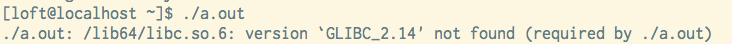

在linux下，运行一个在其他机器上编译的可执行文件经常会类似出现如图所示的`/lib64/libc.so.6: version ‘GLIBC_2.14’ not found (required by ./a.out)` 提示。原因是glibc版本太低，需要在本机重新链接使它使用低版本的glib。但是仔细说来，这是怎么实现的？新旧版本的glibc的文件名和`SONAME`均为`libc.so.6`，均有名为`memcpy`的函数（符号），系统是如何做到版本检测的？如何做到向前兼容的？

## Symbol Versioning

从glibc 2.1开始，它引入了一种叫做[Symbol Versioning](http://people.redhat.com/drepper/symbol-versioning)的机制，每个符号会对应一个版本号，在一个`libc.so.6`文件中可以包含一个函数的多个版本。如：

```
> nm /lib64/libc.so.6 | grep " memcpy"
0000000000088d50 i memcpy@@GLIBC_2.14
0000000000083b00 i memcpy@GLIBC_2.2.5
```

其中`memcpy@@GLIBC_2.14`为默认使用的版本。这样，在这台机器上链接出来的可执行文件，会指向`memcpy@@GLIBC_2.14`，当它在另一台低版本的低于2.14版本的glibc机器上运行时就会找不到改符号。而在低版本的glibc机器上链接出来的可执行文件指向`memcpy@GLIBC_2.2.5`，依然可以在高版本glibc上运行，因为高版本glibc库中包含了该符号。

## Write your own library with symbol versioning

样例：

```c
/// @file libx-1.c  @date 05/10/2015
/// @author i@BlahGeek.com

__asm__(".symver foo_1, foo@@libX_1.0");
int foo_1() {
   return 1;
}

__asm__(".symver bar_1, bar@@libX_1.0");
int bar_1() {
    return -1;
}
```

另外还需要写一个`libx-1.map`文件告诉链接器哪些是global的符号：

```
libX_1.0 {
    global:
        foo;
        bar;
    local: *;
};
```

然后运行`gcc -shared -fPIC -Wl,--version-script libx-1.map libx-1.c -o lib1/libx.so`即可。

然后当我们需要发布一个新版本的libx，其中的`foo()`函数有行为上的改变，我们希望保持它的兼容性，可以增加一个版本号：

```c
/// @file libx.c  @date 05/10/2015
/// @author i@BlahGeek.com

/* old foo */
__asm__(".symver foo_1, foo@libX_1.0");
int foo_1() {
   return 1;
}

/* new foo */
__asm__(".symver foo_2, foo@@libX_2.0");
int foo_2() {
   return 2;
}

__asm__(".symver bar_1, bar@@libX_1.0");
int bar_1() {
    return -1;
}
```

相应的map文件：

```
libX_1.0 {
    global:
        foo;
        bar;
    local: *;
};

libX_2.0 {
    global: foo;
    local: *;
};
```

即可达到与glibc相同的效果：与低版本的库链接出来的可执行文件可以在高版本环境下运行，而且行为不会发生变化；反之则会运行时出错，不会产生意料之外的结果。

## Link to old library

对于下面这段程序：

```c
/// @file test.c  @date 05/10/2015
/// @author i@BlahGeek.com

#include <stdio.h>
#include <string.h>

int main(int argc, char * argv[]){
    char a[] = "Hi";
    char b[] = "Ho";
    memcpy(a, b, 2);
    printf("%s\n", a);
    return 0;
}
```

在我的Archlinux上（glibc版本2.18）编译后可以看到链接的符号为：

```
> nm a.out
…
0000000000400566 T main
                 U memcpy@@GLIBC_2.14
                 U puts@@GLIBC_2.2.5
…
```

如果将它放到一台CentOS 6（glibc版本2.12）上运行就会出现图片中所示的无法找到`GLIBC_2.14`的情况。但是我们依然可以指定它链接低版本的符号：

```c
/// @file test.c  @date 05/10/2015
/// @author i@BlahGeek.com

#include <stdio.h>
#include <string.h>

__asm__(".symver memcpy, memcpy@GLIBC_2.2.5");
int main(int argc, char * argv[]){
    char a[] = "Hi";
    char b[] = "Ho";
    memcpy(a, b, 2);
    printf("%s\n", a);
    return 0;
}
```

可以看到：

```
> nm a.out
…
0000000000400546 T main
                 U memcpy@GLIBC_2.2.5
                 U puts@@GLIBC_2.2.5
…
```

从而可以在CentOS 6上正确运行。
