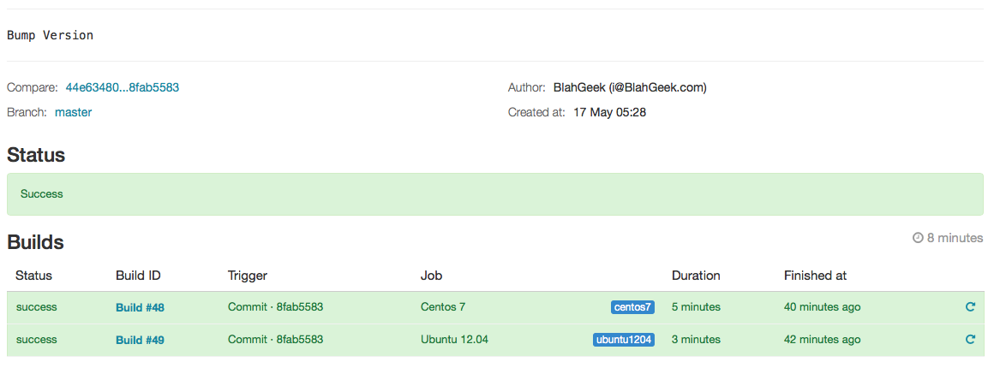
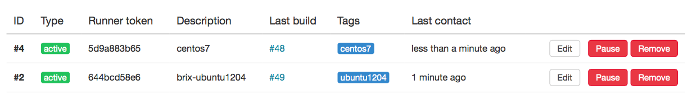
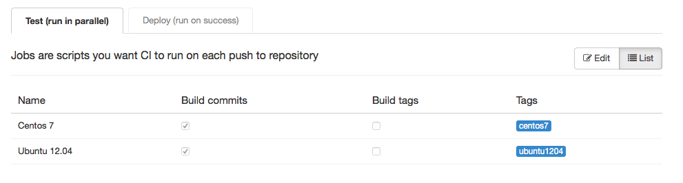

## 需求描述

我们需要给一个项目做自动发布。

我们的代码使用git管理，在一个自建的GitLab中。通常的自动发布很简单，使用GitLab CI部署即可。

但是：

- 我们的项目由多个单独的Git repo组成，相互依赖：如需要先在`transcoder/`中编译出libDT.a，再在`ffmpeg/`中编译出可执行文件（实际项目中包含了4个单独的repo，依赖关系更加复杂）
- 分支之间有依赖关系，比如A的master分支必须与B的master分支一起编译，而A的dev分支必须与B的dev分支一起编译；而且我们希望同时发布各个分支的版本
- 需要在多个平台上发布：如不同版本的Linux（主要由于glibc版本）

问题的关键在于，多个组件中的任何一个产生更新都需要做一次发布，因此无法对单个Git repo部署CI；并且由于分支之间的依赖关系，在每个Git repo上部署CI也很不科学且麻烦。

## git submodule

解决的方法是使用git submodule，新建一个叫做transcoder-build的git repo，其中以git submodule的方式包含所有的组件：

```
> git init
> git submodule add ssh://xxx.xxx/transcoder.git
> git submodule add ssh://xxx.xxx/ffmpeg.git
```

git submodule一个被吐槽无数但是在这里却至关重要的一个特性是：它track的是submodule的commit，而不是branch。也就是说当`transcoder`有新的commit时，`transcoder-build`并不会默认更新，而是需要提交一个新的commit：

```
> git diff
diff --git a/ffmpeg_loft-libdt b/ffmpeg_loft-libdt
index f42de0f..5fecf0b 160000
--- a/ffmpeg_loft-libdt
+++ b/ffmpeg_loft-libdt
@@ -1 +1 @@
-Subproject commit f42de0f383ba5e9e1ef37debfc0103af6ab26fdf
+Subproject commit 5fecf0b351f9034cbcb78c8d0a9578d19f872a4e
diff --git a/transcoder b/transcoder
index 7aa1153..0152e77 160000
--- a/transcoder
+++ b/transcoder
@@ -1 +1 @@
-Subproject commit 7aa1153cea95ab5a58411f1589bd2b4ff02039ad
+Subproject commit 0152e773d002f0ae7b8f6f2057be573ab28ef538
```

我们需要使任何submodule更新时，也自动为`transcoder-build`提交一个新的commit，包含更新的submodule的最新commit：

```bash
#!/bin/bash
# @Author: BlahGeek
# @Date:   2015-05-16
# @Last Modified by:   BlahGeek
# @Last Modified time: 2015-05-16

DIR=$( cd "$( dirname "${BASH_SOURCE[0]}" )" && pwd )
cd "$DIR"

lockfile /tmp/libDT-build-update.lock

git submodule update > /dev/null 2>&1

REPOS=(ffmpeg transcoder)
REPOS_BRANCH=(clean dev)

for i in ${!REPOS[*]}
do
    echo -n "Updating ${REPOS[i]} (branch ${REPOS_BRANCH[i]})... "
    IGNORE_THIS=1
    for x in ${BASH_ARGV[*]}
    do
        if [ $x = ${REPOS[i]} ]; then
            IGNORE_THIS=0
        fi
    done

    if [ $IGNORE_THIS -eq 1 ]; then
        echo 'Ignore'
    else
        cd "${REPOS[i]}"
        git fetch origin > /dev/null 2>&1
        git reset --hard origin/"${REPOS_BRANCH[i]}" > /dev/null 2>&1
        echo 'Done'
        cd ..
    fi
done

if (git diff --exit-code > /dev/null); then
    echo "No submodule was updated"
else
    git commit -am "Bump version"
    git push origin HEAD
fi

rm -f /tmp/libDT-build-update.lock
```

该脚本将`ffmpeg`和`transcoder`分别更新至`clean`和`dev`分支的最新版本，如果有更新，则提交一个commit。然后我们只要在`ffmpeg.git`和`transcoder.git`的`post-receive`中分别调用该脚本`bash update.bash ffmpeg`和`bash update.bash transcoder`（只更新参数中给定的submodule，更快一些）即可做到在任何submodule相应的分支更新时它也发生更新。

之后只需要为`transcoder-build`这个repo部署CI即可：

```bash
git submodule update --init
make -C transcoder
make -C ffmpeg
...
```

## 多个分支的发布

很简单，只需要为`transcoder-build`这个repo创建多个分支即可，在不同分支中相应的修改上述脚本中的`REPOS_BRANCH`。

比如在`master`分支中使用ffmpeg的`clean`分支和transcoder的`dev`分支：

```
REPOS=(ffmpeg transcoder)
REPOS_BRANCH=(clean dev)
```

而在`dev`分支中使用ffmpeg的`dev`分支和transcoder的`newb`分支:

```
REPOS=(ffmpeg transcoder)
REPOS_BRANCH=(dev newb)
```

另外，在`ffmpeg.git`和`transcoder.git`的`post-receive`中也需要更新所有它的分支。我用一个单独的`update-all.bash`：

```bash
#!/bin/bash
# @Author: BlahGeek
# @Date:   2015-05-16
# @Last Modified by:   BlahGeek
# @Last Modified time: 2015-05-16

cd "$( dirname "${BASH_SOURCE[0]}" )"
unset GIT_DIR  # Because I'm in `post-recieve`
cd transcoder-build/

LIBDT_BUILD_BRANCHES=(master dev)

for branch in ${LIBDT_BUILD_BRANCHES[*]}
do
    echo "Updating libDT-build: $branch"
    git checkout -f $branch > /dev/null 2>&1
    git pull origin $branch > /dev/null 2>&1
    ./update.bash "$@"
done
```


## 多个平台的发布

这个需求比较简单…只要在GitLab CI中配置多个Runner，通过不同的Tag使每个commit都在多个runner上运行即可。






