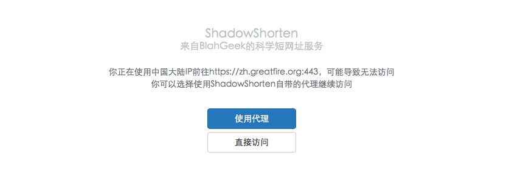
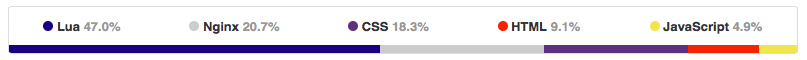

前几天想到一个需求…需要给别人分享一个网址的时候，经常会由于该网址被墙并且对方没有正确的科学上网姿势而不知道怎么办。于是就撸了这样一个东西：**自带代理的短网址服务**。它的功能是：

- 它是一个短网址服务
- 当目标站点被墙（通过greatfire.org检测）并且访问用户来自中国（通过GeoIP检测）时，显示一个提示页面询问是否要使用我提供的代理服务

需要注意的是，这不是一个普通的HTTP代理，它**仅对该短网址的目标网站代理**，防止被滥用等情况。

Demo[在此](http://blaa.cf/4djtgp6c)（只有从中国IP访问时才会有效果，否则只是一个普通的短网址）。代码及How-to[在此](https://github.com/blahgeek/ShadowShorten)

## Lua + Nginx + Redis

第一次使用了Lua+Nginx+Redis这样一个组合。Nginx作为web服务器，Lua作为Nginx的扩展脚本处理简单的逻辑，Redis作为存储后端。对于逻辑简单并且多涉及到需要动态nginx的行为（比如proxy）时这种组合非常方便，并且据称效率很高（Nginx是事件驱动的，加上Lua本来就很快）。
