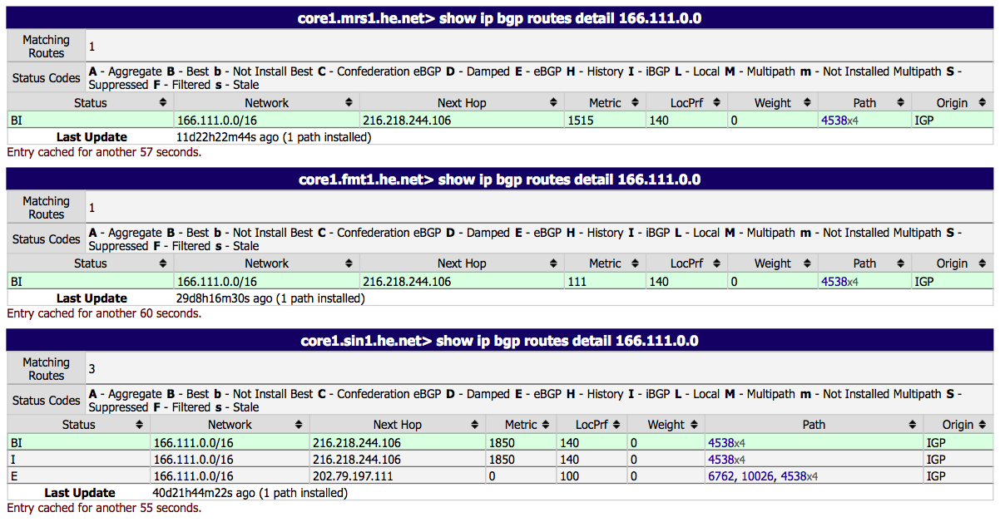
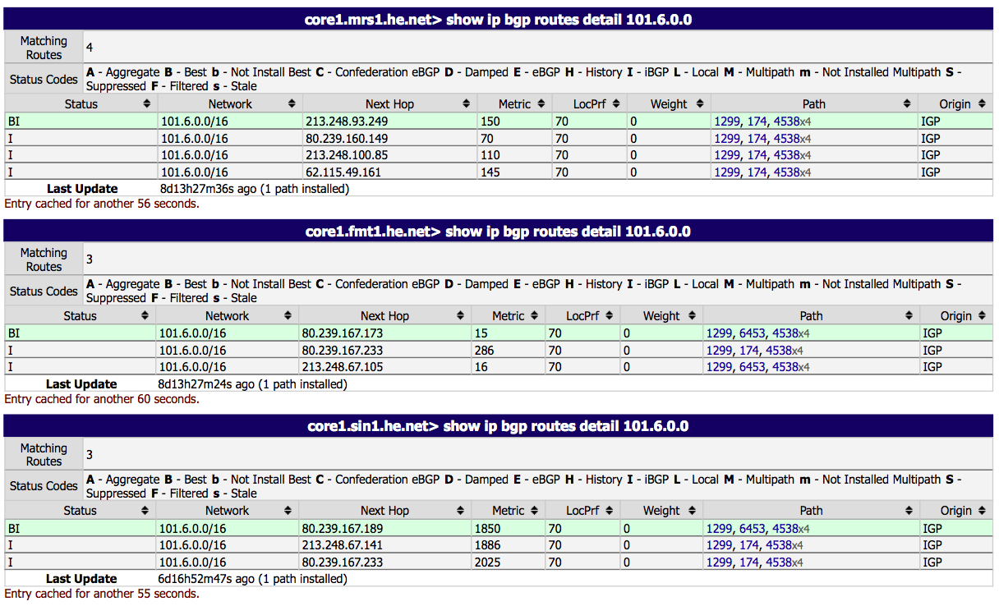

> 事情的起因是几天前突然发现校园网连接Linode新加坡节点（也就是本站所在服务器）的延时（Round Trip Time, RTT）从70ms左右增加到了200ms左右，并且从校内网路由追踪的结果来看路径没有变化（依然是直连，无绕道），感觉事有蹊跷，顺便补一下当初学习的网络原理相关知识，研究了一下其中的原理所在…

## 现象

从校园网的`101.6.0.0/16`和`59.66.0.0/16`网段（分别主要是教学区和宿舍区）Ping新加坡节点的延时为200ms，而从`166.111.0.0/16`网段（主要是办公区、服务器等）Ping的延时依然为70ms左右，并且两者的路由追踪路径看起来完全相同，丢包率也基本没有区别，很奇怪。mtr报告见下（主机及网关IP已隐去）

```
HOST: medialabgw (101.6.x.x)      Loss%   Snt   Last   Avg  Best  Wrst StDev
  1.|-- gateway                    0.0%    10    0.6   0.6   0.5   0.8   0.0
  2.|-- 118.229.2.5                0.0%    10    0.4   0.4   0.4   0.4   0.0
  3.|-- 118.229.2.81               0.0%    10    0.5   0.4   0.4   0.5   0.0
  4.|-- 118.229.2.65               0.0%    10    0.5   0.6   0.4   1.1   0.0
  5.|-- 118.229.4.98               0.0%    10    0.5   0.5   0.5   0.5   0.0
  6.|-- 118.229.4.33               0.0%    10    0.5   0.5   0.4   0.7   0.0
  7.|-- 118.229.4.65               0.0%    10    3.7   5.8   1.4  10.1   2.7
  8.|-- 202.112.38.9               0.0%    10    1.3   1.6   1.3   1.7   0.0
  9.|-- 101.4.116.193              0.0%    10    5.4  10.8   0.7  21.3   8.0
 10.|-- 101.4.116.134              0.0%    10    2.1   3.3   1.9   5.6   1.1
 11.|-- 101.4.117.102              0.0%    10    7.5   4.8   1.3   7.5   2.2
 12.|-- 101.4.117.182              0.0%    10    1.5   2.2   1.2   9.8   2.7
 13.|-- 101.4.117.150              0.0%    10   40.4  40.3  40.2  40.4   0.0
 14.|-- 61.8.59.37                 0.0%    10  181.4 181.8 181.4 183.5   0.6
 15.|-- ip-61-14-147-176.asianetc  0.0%    10  206.6 206.7 206.5 207.4   0.0
 16.|-- gw1.sin1.sg.linode.com    10.0%    10  220.9 221.8 219.0 224.2   1.3
 17.|-- 139.162.0.2                0.0%    10  207.0 207.2 206.9 208.2   0.0
 18.|-- li853-45.members.linode.c  0.0%    10  216.4 219.4 215.2 222.4   2.3
```
 
```
HOST: thusast (166.111.x.x)       Loss%   Snt   Last   Avg  Best  Wrst StDev
  1.|-- gateway                    0.0%    10    0.2   1.2   0.2   9.6   2.9
  2.|-- 118.229.2.81               0.0%    10    0.3   0.3   0.3   0.3   0.0
  3.|-- 118.229.2.65               0.0%    10    0.3   0.3   0.3   0.3   0.0
  4.|-- 118.229.4.98               0.0%    10    0.3   0.3   0.3   0.3   0.0
  5.|-- 118.229.4.33               0.0%    10    0.3   0.3   0.3   0.3   0.0
  6.|-- 118.229.4.65               0.0%    10    6.2   7.5   0.8  21.3   5.8
  7.|-- 202.112.38.9               0.0%    10    1.3   1.5   1.2   1.9   0.2
  8.|-- 101.4.116.193              0.0%    10   32.4  16.5   0.5  34.2  15.2
  9.|-- 101.4.116.145              0.0%    10    6.6   5.7   1.8  14.8   3.6
 10.|-- 101.4.117.98               0.0%    10    3.2   5.0   1.9  15.2   3.8
 11.|-- 101.4.117.182              0.0%    10    1.2   1.2   0.9   1.5   0.1
 12.|-- 101.4.117.150              0.0%    10   40.2  40.2  40.1  40.3   0.1
 13.|-- 61.8.59.37                 0.0%    10   41.1  44.0  40.9  70.9   9.4
 14.|-- ip-61-14-147-176.asianetc  0.0%    10   70.3  70.3  70.2  70.4   0.0
 15.|-- ip-61-14-147-179.asianetc  0.0%    10   70.7  70.8  70.7  72.0   0.4
 16.|-- 139.162.0.6                0.0%    10   70.9  70.9  70.8  71.0   0.1
 17.|-- li853-45.members.linode.c 10.0%    10   70.6  70.5  70.4  70.6   0.1
```

## 原因

路由追踪会依此发送TTL递增的ICMP包，在经过某一跳路由时若TTL等于0则该路由会返回ICMP不可达信息，其计算的延时是从发出ICMP包到收到ICMP回应的整个事件（Round Trip Time）。重点是，这两个ICMP包所经过的路径很有可能是不同的，路由追踪的路径仅仅表示了从源IP到目的IP的包会经过的路径，并无法看出反方向的路径。如果从服务器端对这两个IP进行路由追踪，可以看到：

```
HOST: localhost                   Loss%   Snt   Last   Avg  Best  Wrst StDev
  1.|-- router2-sgp.linode.com     0.0%    10    0.7   0.6   0.6   0.7   0.0
  2.|-- 139.162.0.9                0.0%    10    0.7   0.8   0.7   1.0   0.0
  3.|-- te0-1-0-21.br03.sin02.pcc  0.0%    10    1.6   1.7   1.6   1.9   0.0
  4.|-- tenge0-0-1-3.cr03.sea01.p  0.0%    10  175.5 174.3 174.0 175.5   0.3
  5.|-- tenge0-0-1-3.cr03.sea01.p  0.0%    10  173.8 173.9 173.7 175.2   0.3
  6.|-- 205.177.32.42              0.0%    10  185.4 184.6 184.1 185.7   0.3
  7.|-- be2083.ccr21.sea01.atlas.  0.0%    10  184.3 184.6 184.3 185.0   0.0
  8.|-- be2075.ccr21.sfo01.atlas.  0.0%    10  184.4 184.5 184.3 184.7   0.0
  9.|-- be2164.ccr21.sjc01.atlas.  0.0%    10  184.4 184.5 184.3 184.7   0.0
 10.|-- be2160.ccr21.lax01.atlas.  0.0%    10  184.2 184.1 183.9 184.3   0.0
 11.|-- be2019.ccr21.lax04.atlas.  0.0%    10  191.9 192.0 191.9 192.1   0.0
 12.|-- 38.88.196.186              0.0%    10  214.6 214.1 212.7 215.2   0.5
 13.|-- 101.4.117.169              0.0%    10  214.0 219.3 214.0 228.8   4.7
 14.|-- 101.4.117.101              0.0%    10  216.1 214.7 212.9 216.1   0.8
 15.|-- 101.4.116.133              0.0%    10  212.0 215.3 212.0 243.4   9.8
 16.|-- 101.4.116.194              0.0%    10  213.2 212.9 212.4 214.3   0.3
 17.|-- 202.112.38.10              0.0%    10  212.1 212.1 212.0 212.2   0.0
 18.|-- 118.229.4.66               0.0%    10  212.2 212.2 212.1 212.3   0.0
 19.|-- 118.229.4.34               0.0%    10  212.3 212.3 212.2 212.4   0.0
 20.|-- 118.229.2.74               0.0%    10  212.4 212.4 212.3 212.6   0.0
 21.|-- 118.229.2.90               0.0%    10  212.4 212.7 212.2 213.9   0.3
 22.|-- 118.229.2.85               0.0%    10  212.1 212.1 212.0 212.2   0.0
 23.|-- 118.229.2.6                0.0%    10  212.3 212.4 212.3 212.5   0.0
 24.|-- 101.6.x.x                  0.0%    10  212.5 212.6 212.5 212.6   0.0
```

```
HOST: localhost                   Loss%   Snt   Last   Avg  Best  Wrst StDev
  1.|-- router1-sgp.linode.com     0.0%    10    0.8   0.8   0.6   0.8   0.0
  2.|-- gw2.sin1.sg.linode.com     0.0%    10    1.0   0.8   0.7   1.0   0.0
  3.|-- ip-61-14-147-178.asianetc  0.0%    10    0.4   0.4   0.4   0.5   0.0
  4.|-- ip-61-14-158-69.asianetco  0.0%    10   30.0  30.0  29.9  30.2   0.0
  5.|-- 61.8.59.38                 0.0%    10   30.3  30.3  30.2  30.4   0.0
  6.|-- 101.4.117.149              0.0%    10   70.7  74.7  70.3 112.2  13.2
  7.|-- 202.112.61.13              0.0%    10   69.7  69.7  69.7  69.8   0.0
  8.|-- 101.4.115.186              0.0%    10   71.8  73.5  70.3  77.6   2.0
  9.|-- 101.4.116.146              0.0%    10   72.4  71.0  69.9  74.1   1.6
 10.|-- 101.4.118.78               0.0%    10   70.9  71.1  70.7  71.7   0.0
 11.|-- 202.112.38.10              0.0%    10   70.1  70.1  70.1  70.2   0.0
 12.|-- 118.229.4.66               0.0%    10   70.3  70.3  70.2  70.5   0.0
 13.|-- 118.229.4.34               0.0%    10   70.5  70.4  70.3  70.5   0.0
 14.|-- 118.229.2.74               0.0%    10   72.4  72.2  70.5  73.4   0.6
 15.|-- 118.229.2.90               0.0%    10   70.5  70.5  70.4  70.6   0.0
 16.|-- 118.229.2.85               0.0%    10   70.3  70.3  70.2  70.4   0.0
 17.|-- 166.111.x.x                0.0%    10   70.6  70.5  70.4  70.6   0.0
```

这样就能很明显的看到，从新加坡服务器发往这两个网段的IP包的路由路径是完全不同的，发往`166.111.0.0/16`网段的包走直连线路，而发往`101.6.0.0/16`网段的包绕道了美国Cogent Co.再到达国内，延时因此增加（报告中的第7至第11跳）。

然而仔细想想又感觉不对，从新加坡到美国服务器的RTT就有将近200ms，绕道美国再到国内的RTT为何也只有200ms左右？然而…再仔细想想，这一切还是很科学的：正如刚才所说，路由追踪的RTT是双向延时，而两个方向的数据包路径是有可能不同的。根据这个追踪结果我们可以猜测：**教育网与新加坡的单向延时为35ms、新加坡与美国西海岸的单向延时为90ms、美国西海岸与教育网的单向延时为75ms**；那么可以验证上述结果：**从新加坡至美国西海岸的RTT为90x2=180ms左右（直连），而从新加坡至教育网的RTT为90+75+35=200ms左右（发送的包绕道美国、返回的包直连）**。这也是和常识相符的，并且可以通过其他路由追踪结果进一步验证（比如从教育网到Linode的Fremont机房延时为150ms左右）。

## BGP

对于两个网段的不同路由情况，可以从全球BGP表中看到。在[HE.NET Looking Glass](http://lg.he.net)中对多个地点的路由器中对这两个网段的路由情况进行查询，可以看到：





`166.111.0.0/16`和`101.6.0.0/16`都属于教育网的AS4538，HE.NET为AS6939，与教育网AS4538有直连。从图中可以看出，`166.111.0.0/16`网段的Peer有AS6939（HE.NET自身）和AS10026（Pacnet）、`101.6.0.0/16`网段的Peer有AS174（Cogent Co.）和AS6453（TATA Co.）
。因此从Linode新加坡节点发往`166.111.0.0/16`的IP包通过Pacnet（亚洲）到达，而发往`101.6.0.0/16`的包需要通过AS174（美国）到达。（我还从Linode Fremont节点进一步验证了该结论，从Fremont发往`166.111.0.0/16`的包直接通过HE.NET到达，而发往`101.6.0.0/16`的包经过了TATA，只不过只是在美国西海岸绕了一小圈，基本没有影响）

进一步的，从[AS4538](http://bgp.he.net/AS4538#_graph4)的路由图表中也可以验证该结果。

最后，我的无责任猜测是：与Cogent Co.和TATA Co.的互联价格比较便宜质量比较差，而与HE.NET和Pacnet的互联价格比较贵，所以只给`166.111.0.0/16`这类包含着很多网站服务器的网段使用，提高海外用户访问比如我大清学校主页的用户体验，至于学生宿舍实验室什么的只要能连上就行。难怪前段时间校内开始将实验室的IP从166.111改为101.6了……

> 吐槽归吐槽…我知道相比联不通移不动电x信，校园网的出国线路质量其实还算是不错的…HE.NET出国延时稳定丢包率低带宽跑满7x24小时无忧…还有IPv6……
