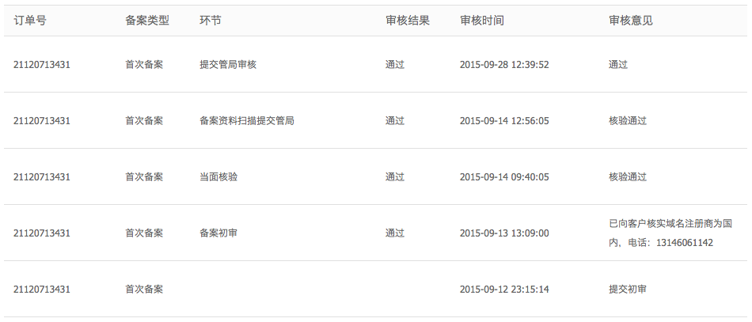
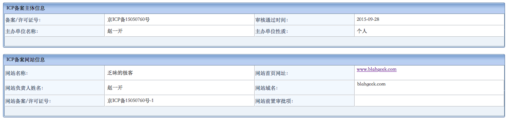

首先，备案是个傻逼政策，这是显然的。

备案虽然傻逼，但是其本身的出发点还是符合政府的神逻辑的：

- 在境内架设网站得听政府的，关键时刻得能查到水表
- 万一查不到水表的情况下，关键时刻政府得能拔网线

于是基于这两条逻辑，政府表示：在境内架设网站得告诉我你是谁以及网站放在哪，任意一个信息变了都得来登记。于是呢，就有了备案制度。不过即使出发点是没问题的，其执行过程依然使得这个制度逃离不了傻逼的命运，比如某些省只能使用国际域名、审核麻烦且时间超长、某些省要求关站备案、某些省要求必须国内注册、换个主机提供商要重新备案等等…完全与现代互联网行业格格不入，而且也完全没什么用：你要查水表拔网线，直接查IP给提供商打电话查信息不就行了？说的倒是很科学似的…

于是…为了体验一下传说中的傻逼制度…我把本站备案了……😂

备案通过阿里云进行，基本流程就是填表－阿里云审核－拍照－管局审核，我在9月12日提交，9月28日通过审核，共历时16天（呵呵）。值得注意的是各个省的管局的规则是不一样的，比如北京要求域名在国内注册并且不支持国别域名，但不要求关站备案，而比如浙江就相反。各种规则可以在阿里云的备案专区中查到（不得不说阿里云把这样一个傻逼政策变的不是那么傻逼了）。一个小插曲就是我的域名是在Godaddy买的，第一次提交的时候就被阿里云给退回来了，然后我把域名转到了小众的[namesilo](http://namesilo.com)估计审核员不认识就给通过了😂

最后…对于个人博客来说，备案后可以折腾的事情还是稍微多了一点的：比如可以使用境内的主机加快访问速度、使用境内CDN、搞微信公众号等等…

最后的最后…北京管局备案的“名称”要求：不能是纯英文、不能是“xx博客”/“xx小站”“xx的个人网站”、不能包含姓名等等等等…于是被拒绝N次后填了这样一个蛋疼的中文译名……

