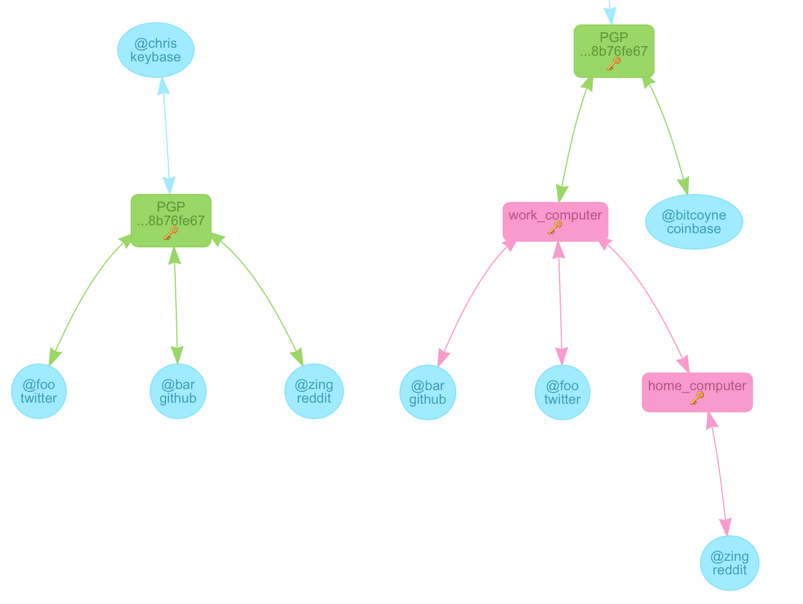
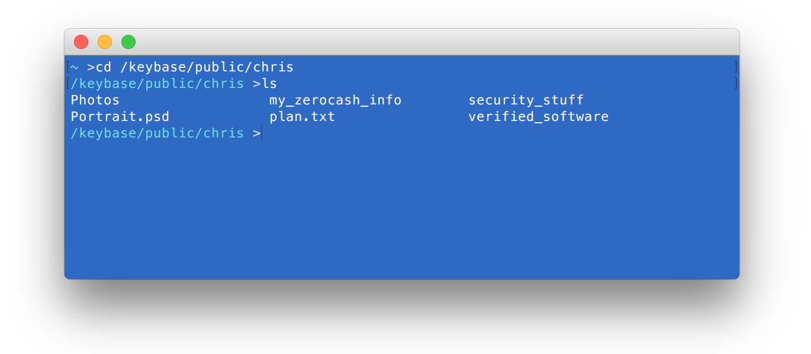
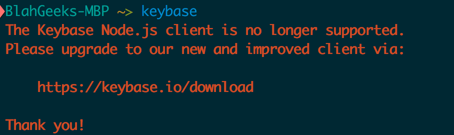

我一般并不会对一个开源项目作出明显的负面评价，毕竟 *Those software is provided "as is", without warranty of any...*，然而Keybase.io这个项目…从一年前开始接触并使用它开始，越来越火却在我看来越来越傻逼，忍无可忍，必须要吐槽一发…

## 1

先说说优点，也就是大约一年前我使用它的原因。Keybase.io（曾经的）核心思想是 **以你的PGP密钥为核心，证明“你是你”** ：比如证明twitter上的`@blahgeek`是我；证明github上的`@blahgeek`是我；证明域名`z1k.co`的所有者是我…等等。为了达到这个目的，我可以在[https://z1k.co/.well-known/keybase.txt](https://z1k.co/.well-known/keybase.txt)这个地址发布如下内容（有删减，点击链接查看完整内容）：

```
I hereby claim:

  * I am an admin of http://z1k.co
  * I am blahgeek (https://keybase.io/blahgeek) on keybase.
  * I have a public key with fingerprint A74A F69A 8CC3 B7F2 28FA  3074 6D7E C222 C6DE 82BF

To do so, I am signing this object:

{
    "body": {
        "service": {
            "hostname": "z1k.co",
            "protocol": "http:"
        },
        "type": "web_service_binding",
    },
    "ctime": 1455338522,
    "expire_in": 157680000,
    "prev": "d9c3b94a17337d4f8c65916e0d1cb1f8814659d48975546a44741cf9edf9d814",
    "seqno": 31,
    "tag": "signature"
}

which yields the signature:

-----BEGIN PGP MESSAGE-----

owGtkltsDUEYx0/r0vS4lQZ1adQSEerYmZ3dnT1CH5REPDQRJCQcc9ue1dPd45xV
qvXg0iBokAp1SdyqLkGIIFGX6iURIY0TJASJB1IhEbwgLjtNJSQezdPkm9/3zf//
n9k1qE8onHXpVP8dZZVTTmfd66ahxTcvj65RqMerlWiNwhKOcH25c0mlUKJKhaim
...
-----END PGP MESSAGE-----

And finally, I am proving ownership of this host by posting or
appending to this document.
```

类似的，我也可以在[Github Gist](https://gist.github.com/77a51b2f02b54320c217)或[twitter](https://twitter.com/blahgeek/status/680974812085272576)上发布类似的内容证明我是Github上的`@blahgeek`或twitter上的`@blahgeek`。之后，我可以将这些信息发布至Keybase.io，同时Keybase.io提供方便的检验和浏览自己和其他人的这些proof的功能（在网页上或者在命令行客户端中）。

在这整个过程中，Keybase.io是不需要被信任的，其仅仅是一个公告板的作用，即使没有Keybase.io网站和客户端，这些proof都是可以使用广泛信任的工具（`gpg`）直接验证的。Keybase.io只是一个方便的生成和检验proof的工具。

# 2

然而…他们想做的太多了。

他们想，使用命令行生成proof太不友好了，让用户把 **PGP私钥** 上传给我们，让用户可以在浏览器上完成吧！以及它表示：上传的私钥是加密的，只有用户输入passphrase之后才能解开，并且加解密操作在浏览器本地使用javascript完成。

呵呵，在浏览器本地使用javascript完成，听起来很安全的样子？可是javascript的内容是网站提供的啊！即使说我检查了一次其开源javascript的代码，如何保证服务器每次返回的javascript没有被篡改呢？再退一步说，即使我完全信任Keybase.io服务器，依然还有流量劫持的风险，安全性依然不能保障。

# 3

再后来…他们又想，使用PGP太不友好了，我们使用一种[新的认证机制](https://keybase.io/blog/keybase-new-key-model)吧！他们决定，给每个设备分配一对密钥（device key），在用户信任设备后就能直接使用设备的私钥来代替PGP私钥来生成proof了！信任链从左图变为右图。



嗯…怎么生成这个device key呢？PGP太复杂了，我们新发明一种密钥系统吧，叫做SaltPack！

呵呵。

[不要发明自己的加密算法。](http://security.blogoverflow.com/2013/06/qotw-47-lessons-learned-and-misconceptions-regarding-encryption-and-cryptology/)
[不要发明自己的加密算法。](http://videlalvaro.github.io/2014/03/you-dont-roll-your-own-crypto.html)
[不要发明自己的加密算法。](http://www.ibm.com/developerworks/library/s-tried/index.html?S_TACT=105AGX52&S_CMP=cn-a-x)

重要的事情说三遍。

当然，我也知道他说SaltPack是基于[NaCl](http://nacl.cr.yp.to)开发的，也算是一个well known的、成熟的库。但是我如何才能信任SaltPack，以及这个 **用来验证proof的在github上只有16个star的[工具](https://github.com/oconnor663/clinacl)**，即使它只是一个wrapper？“不要发明自己的加密算法”，其意义不仅仅在于发明的算法本身是否又漏洞，另一方面意义在于用户信任一个加密工具是需要很高的成本的，即使它使用了可信任的库。（诚然，大多数用户，包括我，并没有阅读过GnuPG的代码，但我信任它，这并不矛盾，就像大多数人并没有环游过世界，但大多数人都可以信任“地球是圆的”这一命题。）

# 4

再再后来…他们又想，用户签名和解密消息太麻烦了，我们开发个[文件系统](https://keybase.io/docs/kbfs)吧！放入该文件系统的文件自动签名然后出现在所有其他人的文件系统中！



在这里，签名信息、加密信息，一切都被隐藏在了程序内部，用户甚至失去了自己使用第三方工具验证签名的机会，一切都依赖与对Keybase.io代码的信任。虽然是开源代码，但如上所说，信任是有很高的成本的。另一方面，KBFS相当于一个中心化的文件存储平台，并且至少其服务器端是闭源的，把重要信息交给它如何放心呢？

# 5

回到最开始所说的核心思想，其实并不需要一个中心化的服务，也并不需要重新发明任何算法，仅仅几段调用gpg的bash脚本用于生成和验证即可，一个公开的索引平台也算是bonus，但却绝对不是现在的越来越中心化、越来越难以被信任的Keybase.io所提供的。

PS：<del>通过`npm`安装的旧版`keybase`工具还依旧仅仅使用GPG制作proof，没有KBFS功能，还是可以作为替代方案使用的。</del> **呵呵**


