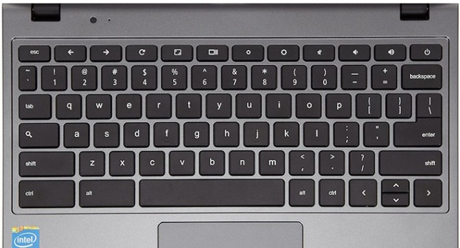
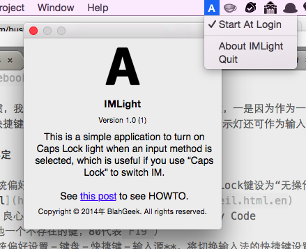

*2016.9.22 Update: 更新了macOS Sierra解决方案，见文末*

## 动机

大写锁定键是我的键盘上用的最少的键。

实际上，在Chromebook上，大写锁定键就被Google换成了更为常用的“搜索键”；另外，也有vimer把大写锁定键用作ESC键，效果拔群。



根据个人习惯，我最终决定将大写锁定键更改为输入法切换键，一是因为作为一个中国人输入法切换是使用最多的一个快捷键之一；另一个原因是因为如此一来键上的指示灯还可作为输入法指示灯，简直完美。

## 更改键绑定

- 打开**系统偏好设置－键盘－键盘－修饰键**，将Caps Lock键设为“无操作”
- 下载[Seil](https://pqrs.org/osx/karabiner/seil.html.en)（良心软件，良心作者），打开后将Caps Lock键映射为Key Code 80（或者其他一个不存在的键，80代表`F19`）
- 打开**系统偏好设置－键盘－快捷键－输入源**，将切换输入法的快捷键设置为`F19`（通过选择后按一下Caps Lock）

Done! 但是现在问题来了：大写锁定的灯永远不亮，这不优美！我们希望指示灯也更改为能够指示输入法状态，即在英文状态下不亮，在拼音/五笔等输入法状态下亮。经过Google发现，OS X提供了控制键盘灯的底层API，可以手动控制其状态，详见[MacLight](https://github.com/busyloop/maclight)。这就好办了，于是我依次尝试了以下几种解决方案：

- 写一段Shell脚本来切换输入法（通过Applescript模拟Keystroke）＋切换指示灯状态，通过Automator新建一个“服务”然后将大写锁定键绑定为运行该脚本。但是经过测试发现延时太大（`~200ms`），放弃。
- 用Objective-C写一个调用底层API的程序来切换输入法（通过`TISSelectInputSource`系列API）＋切换指示灯状态，发现调用API切换输入法后需要切换到下一个输入窗口才会生效，并且延时依然很大，放弃。
- 用Objective-C写一个后台应用，通过`NSDistributedNotificationCenter`接收输入法变更事件，根据状态改变指示灯。科学！

最终采用了最后这种科学的方法。当然，这个后台应用只需要是命令行应用就可以了，通过`launchctl`等方式开机自动启动即可。不过由于强迫症什么的（方便启动、退出，方便加为登录启动项）还是写成了占领在状态栏的应用，并取名为`IMLight`，如下图：



下载链接：[点我](http://cl.ly/2s3P2E1x2A2k) or [Fork me at GitHub](https://github.com/blahgeek/IMLight)

## Update for macOS Sierra

升级macOS Sierra后，Seil无法正常使用了（IMLight不影响），详见Github上的这个[issue](https://github.com/tekezo/Seil/issues/68)，并且由于是系统接口的大改动，一时半会儿可能不会有修复更新。

Issue中也有人提到，可以使用作者正在开发的另一个针对Sierra的项目[Karabiner-Elements](https://github.com/tekezo/Karabiner-Elements)，但是这个项目对我来说有几个问题：

- 与IMLight冲突，[不知道什么时候能修复](https://github.com/tekezo/Karabiner-Elements/issues/1257)
- 会使得系统偏好设置中的针对多个键盘的修饰键设置失效（比如无法把外接键盘的alt和cmd互换），作者表示[无法修复](https://github.com/tekezo/Karabiner-Elements/issues/35)

另外的解决方案是在系统偏好设置中把Caps Lock设置为Ctrl（或者其他），然后用其他软件重映射，比如Keyboard Maestro（更改Caps Lock这件事情比较底层，需要内核级别的修改，而监听Ctrl等键这件事情就很简单了）。我使用免费的[hammerspoon](http://hammerspoon.org)来实现：

```lua
local M = {}

local events = hs.eventtap.event.types
M.log = hs.logger.new('caps_remap', 'info')

M.last_flags_1 = {}
M.last_flags_0 = {}
M.last_time_1 = 0
M.last_time_0 = 0

M.timeout = 0.15
M.key = "ctrl"
M.action = function() hs.eventtap.keyStroke({}, "f19", 0) end

local function _dict_has_no_other_key(dic)
    for k,v in pairs(dic) do
        if k ~= M.key then
            return false
        end
    end
    return true
end

function M.event_callback(e)
    local typ = e:getType()
    local code = e:getKeyCode()
    local flags = e:getFlags()
    local now = hs.timer.secondsSinceEpoch()

    if _dict_has_no_other_key(flags) and not flags[M.key]
        and _dict_has_no_other_key(M.last_flags_0) and M.last_flags_0[M.key]
        and _dict_has_no_other_key(M.last_flags_1) and not M.last_flags_1[M.key]
        and now - M.last_time_0 < M.timeout
        then
        M.log.i("Fire caps action")
        if M.action then
            M.action()
        end
    end

    M.last_flags_1 = M.last_flags_0
    M.last_flags_0 = flags

    M.last_time_1 = M.last_time_0
    M.last_time_0 = now

    return false
end


function M.init(options)
    if options.key then
        M.key = options.key
    end
    if options.timeout then
        M.timeout = options.timeout
    end
    if options.action then
        M.action = options.action
    end
    M.watcher = hs.eventtap.new({events.flagsChanged}, M.event_callback)
    M.watcher:start()
end

return M
```

即快速按一下ctrl（即Caps Lock）会触发F19，而其他包含ctrl的组合键并不会，可以满足要求。

