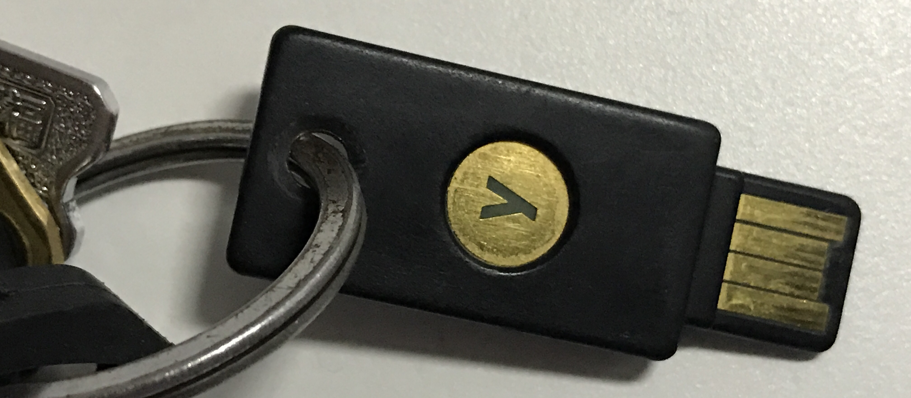
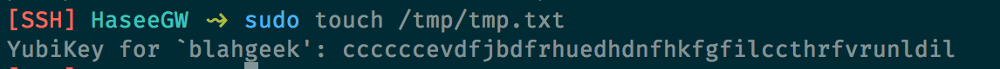
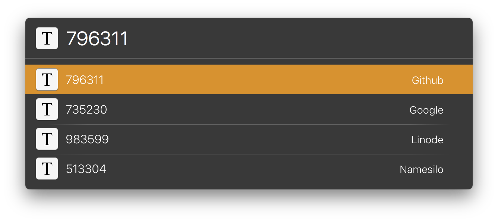
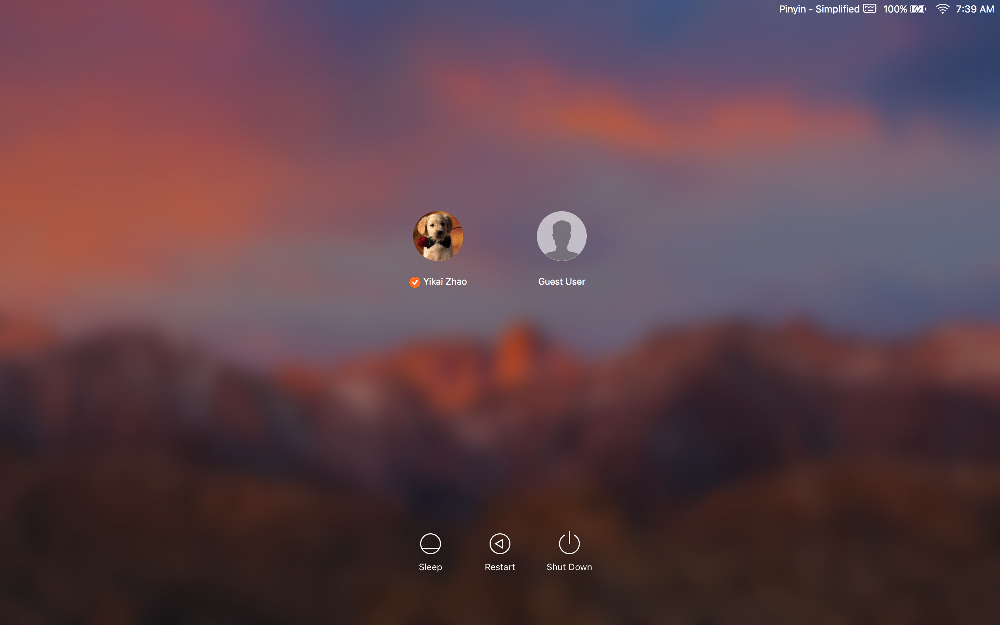
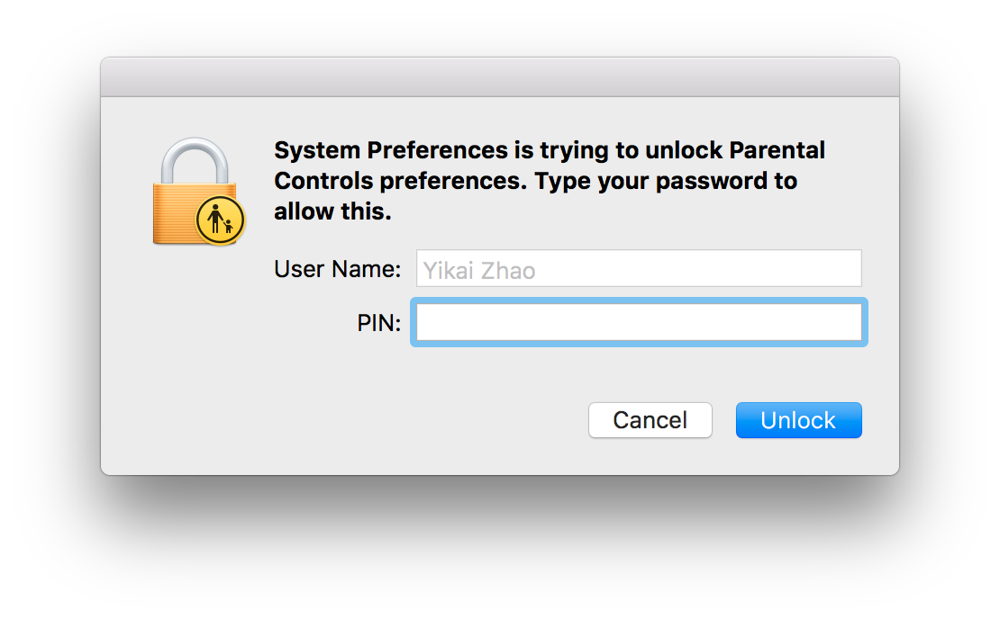
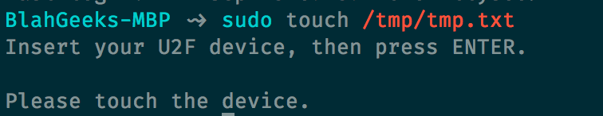

去年的时候买了个Yubikey 4，写了篇[介绍](/yubikey-intro/)。过了将近一年，来分享一下自己的各个使用场景。

如介绍中所说，Yubikey 4包含3中运行模式（接口），分别为OTP、CCID和U2F，这三种模式可以同时使用，使用`ykpersonalize`命令`-m`选项设置，一般设置为`0x86`，即同时打开，详见`ykpersonalize`的manpage。

- OTP模式：Yubikey作为HID键盘设备，这也是Yubikey最传统的模式，旧版本的Yubikey也都支持该模式。该模式下可以同时配置两个configuration slot，通过长按和短按来区分。每个configuration slot分别可以选择OTP、static password、challenge-response、HOTP中的一种。
- CCID模式：包含OpenPGP smartcard、PIV和HOTP，均可以同时配置使用。OpenPGP和PIV类似，均为存储非对称加密的私钥；该模式下的HOTP与OTP模式下的HOTP不同，是一个新的单独的模块，支持最多[32个HOTP](https://www.yubico.com/faq/how-many-credentials-can-i-store-with-yubico-authenticator/)，见下。
- U2F模式：非对称加密，对不同服务[生成单独的私钥](https://developers.yubico.com/U2F/Protocol_details/Overview.html)。

详情见[上一篇介绍](/yubikey-intro/)和官网的文档。

## OTP: VPS sudo / fastmail / ...

我的第一个OTP的configuration slot配置为标准的OTP（默认）。这个模式的优点是兼容性好，只是作为键盘设备输入一串动态密码，缺点是**需要进行联网验证**。因此使用场景为支持用该模式做两步验证的网站，比如[fastmail](/fastmail-is-good/)，另外我也用作服务器上运行sudo的验证（或者也可以作为ssh登录验证），使用[yubico-pam](https://developers.yubico.com/yubico-pam/)配置实现。

## TOTP: 大部分其他网站

[TOTP](https://en.wikipedia.org/wiki/Time-based_One-time_Password_Algorithm)是一个通用的用于二次验证的协议，[Google Authenticator](https://support.google.com/accounts/answer/1066447?hl=en)等App实现的均为这个协议，大部分支持两步验证的网站也都是使用了TOTP，比如**Google、Github**等。Yubikey也可以用来实现TOTP（基于HOTP），需要一个[外部App](https://developers.yubico.com/yubioath-desktop/)来提供时钟，而密钥保存在Yubikey中。我使用一个LaunchBar的脚本来实现方便的密码获取。

注意的是Yubikey 4的TOTP是通过CCID接口实现的，与其他功能独立，可以最多保存32个网站的密钥；旧版本的Yubikey没有单独的TOTP功能，但是可以使用OTP模式下的challenge-response模拟，一个configuration slot相当于一个网站（所以并没有什么用），详见[这里](https://www.yubico.com/faq/how-many-credentials-can-i-store-with-yubico-authenticator/)。

支持TOTP的网站列表可以参见[https://twofactorauth.org](https://twofactorauth.org)。

## PGP Smartcard

不必多说，可以保存多个最长4096位的PGP私钥，当需要解密、签名时插入Yubikey并触碰，非常方便。

## PIV: macOS

[PIV](https://developers.yubico.com/PIV/)也是一个标准协议，类似PGP Smartcard保存了私钥。macOS Sierra更新原生支持了使用PIV登录系统，配置方法见[这里](https://www.yubico.com/2016/09/yubikey-smart-card-support-for-macos-sierra-2/)。另外，据说Windows也原生支持PIV的登录，虽然我没用过。

在macOS下插入一个配置好的PIV设备会自动弹出是否用作认真设备的对话框，或者在命令行下使用`sc_auth`命令添加、查看和删除。配置完成后，在登录、锁定界面可以看到用户名下方出现了一个✅，此时插入设备会自动提示输入PIN码，然后即可登录；另外，在系统内认证时，插入设备后Password项也会自动变成PIN。

## U2F: 本地sudo验证

虽然macOS Sierra支持了PIV登录系统，但是其他操作比如sudo并不支持，还是需要自己使用单独的pam模块。对于本地机器而言，使用需要联网验证的OTP模式并不合适，因此使用U2F，pam-u2f模块[在此](https://github.com/Yubico/pam-u2f)。

顺便一提，macOS上使用brew安装的pam-u2f依赖的[hidapi](https://github.com/signal11/hidapi)版本有问题，会导致偶尔无法识别Yubikey的现象，需要安装最新的master，详见[这个issue](https://github.com/Yubico/pam-u2f/issues/39)。

同时，U2F也适用于包括Google，Github在内的一些网站的两步验证，然而目前只有Chrome浏览器支持，兼容性不好，因此我暂时没有使用，两步验证基本使用上面提到的TOTP或者OTP。

## Static Password

最后，我把OTP模式的第二个configuration slot配置为一个复杂的静态密码，用作macOS和iOS的登录密码。这个密码基本不需要被用到，因为如上所说macOS的已经配置可以使用PIV登录（以及我还配置了Apple Watch Auto Unlock），而iOS上则使用Touch ID指纹解锁。然而，该密码同时为Keychain的加密密码（等同1Password的master password，只是我没有跨平台需求，所以直接使用iCloud Keychain），在使用Keychain查看密码时必须输入该密码。

---

恩，以上就是我用到的所有Yubikey功能，至此所有功能都配置完了。这一年的使用体验还是非常不错的，逼格满满，强烈建议入手。

PS：记得做好备份/其他方式验证，防止Yubikey丢了的情况（倒是应该不会坏…）