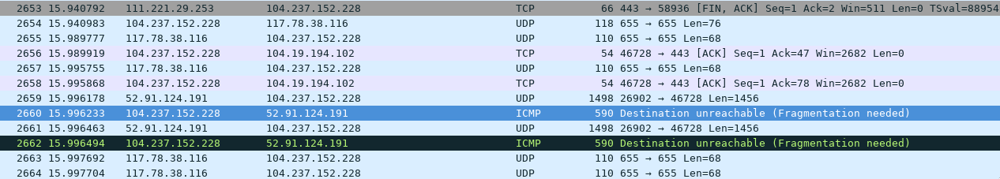

> 好久没写博客，找点事情写一下…

### 无法连接服务器

之前和女朋友入坑了Minecraft PE (iOS version)但是由于搭多人游戏Server体验并不十分友好（主要是懒…）加上轻微3D眩晕一直没怎么玩。今天发现新版本已经增加了Minecraft Realm（即官方版本的Server）于是又准备开坑玩一玩。

然后就遇到了蛋疼的事情：登录，购买，新建Realm，邀请好友，上传地图，一切顺利，然而点击开始后一直无法载入；更加扯淡的是当我切换会公共WiFi连接时竟然可以载入，无法载入的问题仅发生在我的（可翻墙的）个人WiFi上。

### 这不科学


这是我的（简化过的）网络拓扑结构图。设备经过家庭网关连接互联网，其中非中国IP网段通过VPN从美国某VPS连接，VPN使用tinc。在家庭网关上使用chinadns+dnsmasq提供干净的DNS。

由于CDN等因素的存在，该网络结构的确在少数情况下会出现访问某些站点与预期不一致的情况（比如某域名可能针对国内国外配置了不同的DNS，并且国内DNS只响应国内IP，国外DNS只响应国外IP，并且chinadns和路由表判断不统一的情况）。于是我先对这类情况进行了排查，分别关闭了国内/国外DNS的结果，或者分别关闭国内/国外IP的特殊路由，发现问题和DNS无关，只和路由有关；只要连接从VPS走，连接就会超时。那可能是服务器屏蔽了该VPS的IP（就像netflix）？我进一步做了排查，将VPN出口配置到国内某VPS，依然不行。看来是通过VPN链路就会导致连接失败。

这就非常神奇了，这个网络结构已经稳定使用几年了，并且其他各种链接不管是墙内还是墙外都依然正常，就单单是Minecraft Realm无法连接。

### 抓包之

先在Home Router上抓。看到手机和服务器之间既有TCP又有UDP连接，均有大量来回，只是从某一刻开始UDP包就变成了只发不收，大概就是这样造成了连接超时；但是从结果来看并没有发现其他异样，看起来更像是程序（或服务器）的BUG而不是网络问题。

然后在VPS上抓，果然发现了奇怪的东西：



**Destination Unreachable (Fragmentation Needed)**!

问题就在这里。某个从服务器发来的UDP包太大了，超过了VPN链路的MTU（VPN链路由于存在额外的开销，MTU往往小于以太网MTU）；但是ICMP通知发送后并没有发生变化，服务器依然尝试发送同样太大的包，这就造成了从某个时刻以后client就再也没有收到来自服务器的UDP包了，也就造成了超时。不过话说回来，为什么之前从来没有在其他应用/网站上遇到过这样的问题呢？

### 然而这依然不科学

网络中处理MTU的事情的正常协议是这样的：

- 很多情况下，链路层协议会控制发送包的大小，如TCP包含MSS字段来协商包大小
    - 于是大多数VPN程序都包含“Clamp MSS”的功能，来修改TCP包头中的MSS字段来控制包大小
    - 但是UDP并没有这样的机制，需要依靠网络层
- 一般情况下，网络层设备可以将过大的IP包分片后转发，由最终的接收端将分片的包恢复
    - 但是如果IP头中的Do-not-fragment位被置为一，则其不允许被分割，该设备应向源地址发送ICMP通知（即上面抓到的包）
    - 发送端在接到包过大的ICMP通知后应该减小发送包的大小

所以除非是一个服务使用了（除了DNS服务本来就不是很常用的）UDP协议，并且把DF置为了一，并且无法正确处理返回的ICMP包，绝大多数情况下这个小MTU是不会引发问题的。万万没想到今天还真的被我遇上了…

### 解决

其实之前CloudFlare也遇到过这样的问题，写了[这篇博客](https://blog.cloudflare.com/path-mtu-discovery-in-practice/)。他们就是由于某些配置原因，把返回的ICMP包丢掉了，于是发生了一模一样的问题。然而他们是server端，可以从根源上修复这个问题；我还是别指望大微软能看到我的反馈了，只能在client端蜜汁hotfix了…

最简单的解决方案莫过于把包头的DF位清除掉，让VPS转发的时候对其分片即可。虽然IP包分片会一定程度上影响网络效率，但是也没有更好的办法了；另一方面，由于TCP协议可以自动协商包大小而跟这个无关，因此也不会有大的影响。要把包头的DF位清楚，能想到几个思路：

- 使用iptables的QUEUE目标，将匹配的包发送至userspace，用[NetfilterQueue](https://pypi.python.org/pypi/NetfilterQueue)等处理
- 在VPN（tinc）代码中将输入的包修改

出于简单考虑，我使用了第二种方法。在tinc代码的`src/route.c`中有如下几行：

```c
if(packet->data[20] & 0x40) {
    packet->len = MAX(via->mtu, 590);
    route_ipv4_unreachable(source, packet, ether_size, ICMP_DEST_UNREACH, ICMP_FRAG_NEEDED);
} else {
    fragment_ipv4_packet(via, packet, ether_size);
}
```

于是直接在前面加上（需要将其改掉而不是只是修改分支条件，否则根据后面代码分片后的包头的DF位依然存在，不符合标准）

```c
packet->data[20] &= ~0x40;
```

编译替换后，完美解决。

### 总结

于是游戏没玩成先修了半天网…哎…这简直…黑微软黑的我已经没有力气了……
