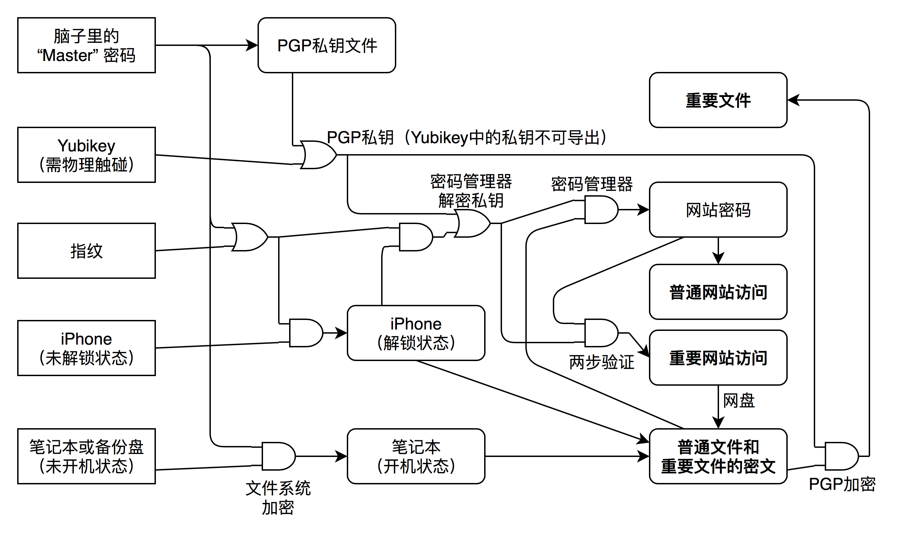

## 个人信息安全需求

一个人对于一项隐秘的内容，其需求包含两点：不让别人获取，以及方便自己获取。
同时，一个人一定拥有多项隐秘的内容，对于不同隐秘内容，他们的重要程度是不一样的。

对于这样的个人信息安全需求，
最简单常用的方式是使用密码管理软件，即为每一个网站分别设置独立的强密码储存在密码管理软件中，同时也可以存储一些文件，然后由密码管理软件使用一个密钥对他们统一进行加密。
但其实这种方案并不能非常好的满足以上几条需求：首先，加密的所有内容得到的加密级别是一样的，你的某论坛密码和绝对不想让人看见的机密文件在安全性上没有区别；这会引出之后的问题，
即如果你将解密过程设置的非常复杂（比如存储在离线硬盘中，使用硬件加密设备），那么要获取到一些其实不是很重要的信息的过程也变得非常麻烦，而且也存在丢失的风险；而如果你将解密过程设置的非常复杂（比如存储在网盘上，使用简单六位密码），那么非常重要的信息也一并变得容易泄露。

因此其实我们需要一个多层级、互相牵制并且互相补充的“加密网”来保护个人信息安全，并且对这个结构自己需要有清晰的认知，能够明确了解到自己能够应对哪些信息安全攻击，不同的意外将会造成怎样的后果。

下面我来分享一下我多年来使用的个人信息安全模型。（如[密码学](https://en.wikipedia.org/wiki/Security_through_obscurity)，公开个人信息安全模型不应该影响个人信息安全性。）

## 模型图

图中，矩形框表示物理世界中的事物；圆矩形框表示数字世界中的事物；加粗的圆矩形框表示我最终需要保护的信息。图中的连接关系均为有向，表示通过一件事物可以获得另一件事物；而与或门则表示获取过程中的逻辑依赖关系，与门表示两个事物需同时存在，或门表示两个事物只需存在一个。

最左边一列为物理世界中的事物，或者称为“源”，分别有：

- **脑子里的“Master”密码**：这是我脑子里记住的一个高强度长密码，该密码只用于直接输入，不存储、不传输，不存在于其它任何地方。不可复制（因为大脑不能复制）、无法被窃取（因为读心术暂时不存在）、很难丢失，但易用性一般（因为太长），需要注意[五美元扳手攻击](https://xkcd.com/538/)。
- **[Yubikey](https://blog.blahgeek.com/yubikey-review/)**：物理加密设备，并且在使用时必须经过物理触碰以及一个简单的六位密码验证，无法被远程利用，不可复制、易用性好，有较小可能性丢失或被窃取。
- **指纹**：无法丢失，易用性好，但可能被窃取。
- **iPhone（未解锁状态）**：关机或锁屏状态下的iPhone，可能丢失或被窃取，但其数据内容是加密的。
- **笔记本（未开机状态）或备份盘**：可能丢失或被窃取，但其数据内容是加密的。

加粗的圆矩形框中的内容表示我需要保护的信息，分别有：

- **重要文件**：我不想给任何其他人看的文件。
- **普通文件和重要文件的密文**：各种不太重要的文件，以及被加密后的重要文件。
- **普通网站访问权限**：一般不重要的网站的访问权限。
- **重要网站访问权限**：重要网站的访问权限，包括网盘等，因此通过它们可以访问到普通文件。

然后，从“源”开始，依赖于各个条件可以获得各项数字内容，包括：

- **PGP私钥**：这是许多后续内容解密的基础。私钥可以由“Master”密码解密一个公开文件得到，也可以直接使用Yubikey，Yubikey中的私钥只能使用不能导出。
- **网站密码**：各个网站的用户名密码，它使用[Passwordstore](https://www.passwordstore.org)管理，它需要使用PGP私钥或者iPhone加上指纹认证进行解密，其密文内容属于“普通文件”，因此同时需要可以访问到“普通文件”。通过网站密码可以得到普通网站的访问权限。
- **重要网站访问权限**：重要网站不仅需要网站用户名密码，还需要进行两部验证。两部验证信息存储方式和网站密码相同，依然需要PGP私钥或iPhone加上指纹认证。虽然两步验证信息和网站密码安全级别相同，但是网站密码有可能被传输过程中截获，两步验证可以防止重放攻击。
- **iPhone（解锁状态）**：iPhone的闪存内容是硬件加密的，需要“Master”密码或者指纹（第一次开机后）将其进行解锁。iPhone中可以访问普通文件和重要文件的密文。
- **笔记本（开机状态）**：笔记本的文件系统以及备份磁盘也是加密的，需要“Master”密码进行解锁。但是笔记本存在着另外的被黑客远程攻击的风险，该风险不受文件系统加密保护。通过这里可以访问到普通文件和重要文件的密文。
- **重要文件解密**：最后，重要文件需要通过PGP私钥对密文进行解密得到。

## 分析验证

基于这样的图表，我可以很方便的对各项风险进行排查。举例来说，如果：

- **Yubikey被盗**（期望发生间隔：三年）：什么都不会发生，除非通过Master密码同时获得普通文件访问权。
- **笔记本被物理访问**（期望发生间隔：一个月）：没有密码无法解锁或开机，什么都不会发生。
- **笔记本被远程攻击**（期望发生间隔：十年）：即开机状态的笔记本被获取，则普通文件将被访问，但没有进一步风险。
- **iPhone丢失**（期望发生间隔：三年）：什么都不会发生，因为密码管理方面可以用Yubikey代替，访问文件方面可以用笔记本代替。
- **失忆，失去Master密码**（期望发生间隔：五十年）：那样的话…这一切还重要么？

类似这样的分析可以多种多样，可以倒着分析某一项信息需要满足哪些条件才会被泄露或丢失，或者分析各种意外发生的组合后果等等。

---

你的个人信息安全模型是什么样的？
