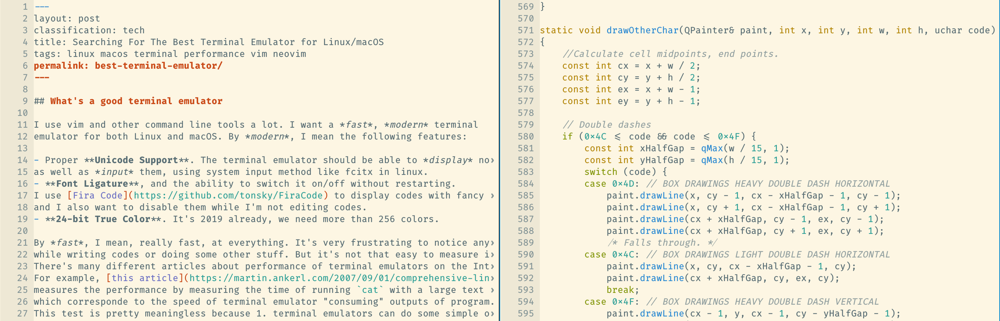
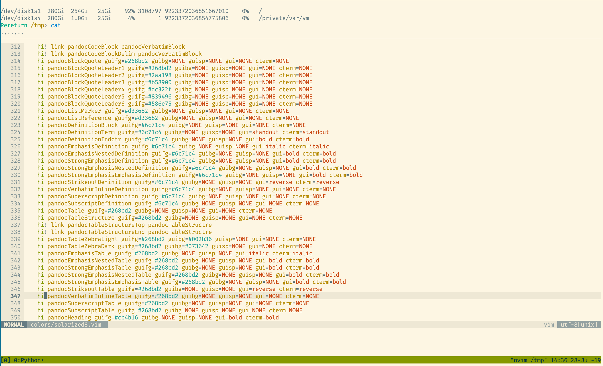
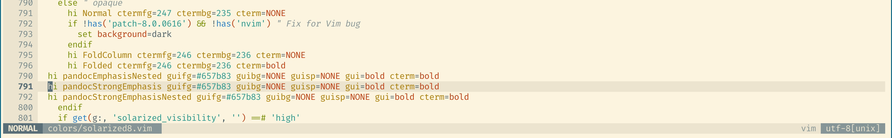

## What's a good terminal emulator

I use vim and other command line tools a lot. I want a *fast*, *modern* terminal
emulator for both Linux and macOS. By *modern*, I mean the following features:

- Proper **Unicode Support**. The terminal emulator should be able to *display* non-latin characters
as well as *input* them, using system input method like fcitx in linux.
- **Font Ligature**, and the ability to switch it on/off without restarting.
I use [Fira Code](https://github.com/tonsky/FiraCode) to display codes with fancy symbols,
and I also want to disable them while I'm not editing codes.
- **24-bit True Color**. It's 2019 already, we need more than 256 colors.

By *fast*, I mean, really fast, at everything. It's very frustrating to notice any delay or flickering
while writing codes or doing some other stuff. But it's not that easy to measure it.
There's many different articles about performance of terminal emulators on the Internet.
For example, [this article](https://martin.ankerl.com/2007/09/01/comprehensive-linux-terminal-performance-comparison/)
measures the performance by measuring the time of running `cat` with a large text file,
which corresponde to the speed of terminal emulator "consuming" outputs of program.
This test is pretty meaningless because 1. terminal emulators can do some simple optimization
to not display each characters and 2. no one would do that in reallity.

What we really should care about regarding performance is the *latency*.
There's already several [good](https://lwn.net/Articles/751763/) [articles](https://danluu.com/term-latency/)
and one really great tool called [Typometer](https://pavelfatin.com/typometer/).
The main idea is to measure the delay between an input event and the corresponding screen update.
In the case of Typometer, it's the delay between generated input event of pressing "dot" and the appearence of "." on screen.

There's also one small issue with these tests. They measure the latency of typing while the terminal emulator is idle
(in [Danluu's test](https://danluu.com/term-latency/), tests under different system load are conducted,
but it's different between *system load* and *terminal emulator load*).
This is different from the real use case. When we are using vim or other terminal applications, there are lots of screen update happening
in each input event, e.g., auto-completion popups, status line updates, syntax color updates, etc., instead of just single update with one character.
That way, the terminal emulator need to process many screen updates on each frame which can cause much more latency.

I suggest that in addition to the latency test conducted above, we should also measure the type-to-display latency
while the terminal emulator is in heavy load. We can perform this test using tmux, Typometer and [asciinema](https://asciinema.org/):

- Record an asciinema session of using vim to edit/scroll a syntax-heavy file.
- Open tmux, create two splitted panes. Replay the asciinema session in one of the panes.
- Measure the latency as usual using Typometer, in the other tmux pane.

## What's wrong about X

With above criteria set, here's what I've found about almost all existing terminal emulators (yes, I've tried all of them, I really want a good terminal):

> TODO: List numbers of measurement.

- **Terminal.app (macOS)**: No true color support. Feels laggy while scrolling in vim.
- **[Alacritty](https://github.com/jwilm/alacritty)**: It is pretty fast as it claims to be. But it cannot render unicode or font ligatures.
- **[Hyper](https://hyper.is/)**: Built with electron. Super slow.
- **urxvt, xterm, st (Linux)**: No font ligatures support.
- **Terminator, xfce4-terminal，lxterminal (Linux)**, and all other libvte-based terminals: No font ligature support.
- **Konsole, gnome-terminal (Linux)**: Actually pretty good under linux, but cannot run in macOS.

### iTerm2 (macOS)

[iTerm2](https://www.iterm2.com/) is actually a great terminal emulator in macOS. It supports all of mentioned features and many others.
iTerm2 supports GPU rendering, unfortunately it cannot work with font ligatures.
But even without GPU rendering, iTerm2 performs pretty well in latency tests (some huge improvement landed in recent 3.1+ versions).
Yet, somehow, I always feel a little laggy using it, especially while scrolling in vim.
It turns out that, iTerm2 sometimes would render only *half* of a screen update, making the screen flickering a lot.
The following frame which is captured from a screen recording while I'm using vim shows this behavior.
The line numbers are not continous as only some of the lines are updated at the moment.
The other lines will be updated right away in the next frame, but it doesn't work for me. It looks awful.

### Kitty

[Kitty](https://sw.kovidgoyal.net/kitty/) is another great terminal emulator and it runs on both Linux and macOS.
Using GPU rendering, Kitty is really fast at drawing texts. It can also draw font ligatures very well.
However, the unicode support in Kitty is not very good.
I [helped](https://github.com/kovidgoyal/kitty/pull/1586) fix some issues about input method support
in macOS but there's still no proper support in Linux.
Also, I've encountered several times of freezing to death in macOS.

## QTermWidget

Finally I found [QTermWidget](https://github.com/blahgeek/qtermwidget).

It's a terminal widget for Qt5. It's the building block of [QTerminal](https://github.com/lxqt/qterminal).
As it's written in Qt, it uses platform-specific CPU-based text rendering method, which makes it
support font ligatures and unicode display/input natually.
It's not fast before, but with my [patch](https://github.com/blahgeek/qtermwidget/commit/159850ba9e867949e3251c8c1d85bf6fb8e568e3)
(not merged to upstream yet) which caches the text glyphs and layouts on each draw, it's fast enough now.
With some small tweaks, it also runs great in macOS just like in Linux.

QTermWidget itself is only a Qt widget instead of a complete application.
If you want a complete ready-to-use terminal emulator without much to customize, take a look at QTerminal.
For me, it's great to have QTermWidget because it's *hackable*.
There's many features I don't want from other terminal emulators, like tabs and panes
(because I use tile window manager, it's the WM's job to arrange windows), lots of non-standard keyboard shortcuts,
nonsense terminal level auto-completion and so on.
QTermWidget contains exactly the functions of a terminal emulator and nothing else.
It's simple enough that you can just `new QTermWidget` to get a fully functional terminal emulator.
It's also flexible enough that you can change the fonts, set scroll bar behavior, add triggers for output text etc., using your own code.
Personally I created [bqterm.cpp](https://github.com/blahgeek/qtermwidget/blob/bqterm/bqterm/bqterm.cpp)
with my own features like control socket, macOS-specific window style adjust, custom cd-to-current-working-dir on start-up.
I use it as my main working terminal emulator on Linux as well as macOS now.

## Future

The search for the best terminal emulator is far from finished yet.
It's hard to believe that we cannot simply build a fast but feature rich terminal emulators in 2019. It's just texts anyway.
Unicode is so messed up, which makes CPU rendering slow.
GPU rendering is fast but there's no cross-platform way to do proper text rendering and doesn't support common features like input method.
Other than terminal emulators, there seems to be no one trying to do lots of text rendering using GPU?
Oh, maybe we can build a terminal acceleration card with terminal processing unit (TPU)!
